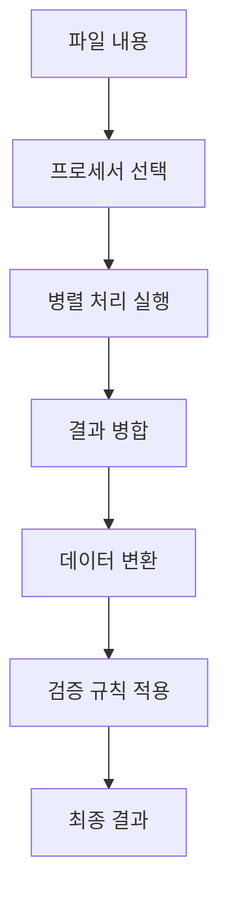
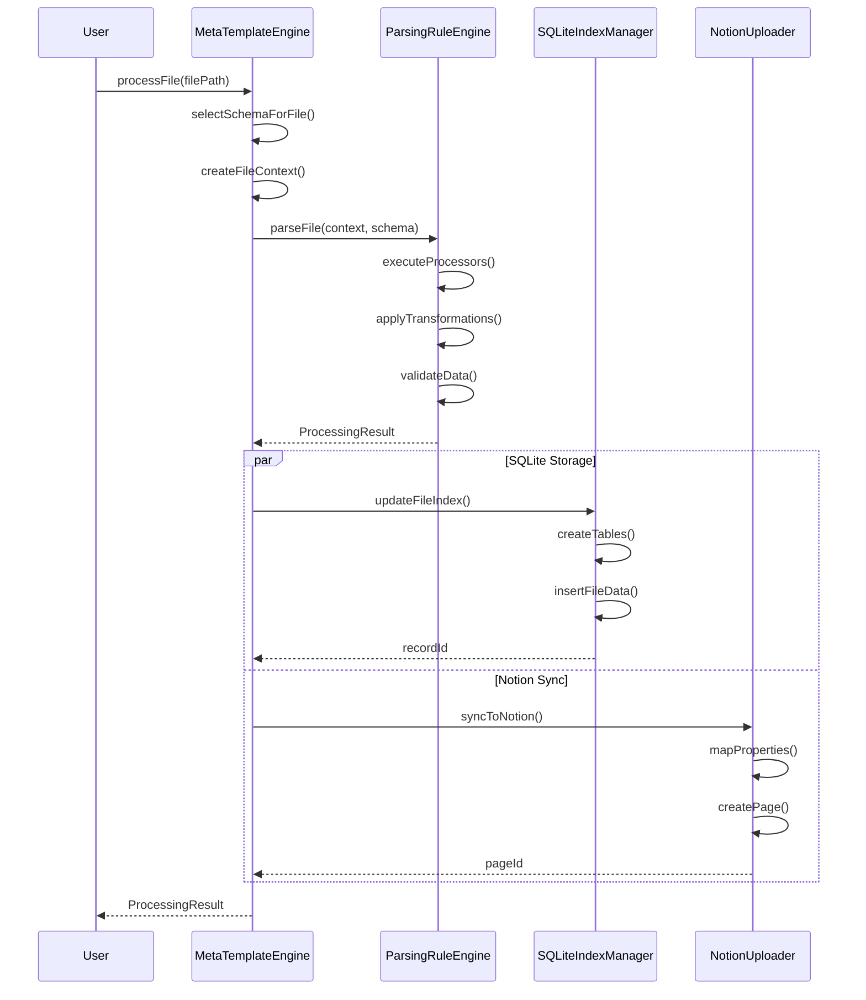
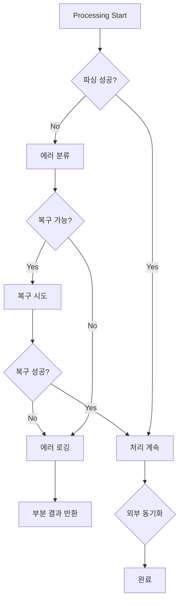

# 🏗️ Meta Template System - Architecture Documentation

## 📐 시스템 아키텍처 개요

Meta Template System은 모듈식, 확장 가능한 아키텍처로 설계되어 다양한 파일 형식과 분석 요구사항을 지원합니다.

## 🎯 핵심 설계 원칙

### 1. **관심사의 분리 (Separation of Concerns)**
- **파싱**: `ParsingRuleEngine`이 데이터 추출만 담당
- **저장**: `SQLiteIndexManager`가 데이터 저장만 담당  
- **동기화**: `NotionUploader`가 외부 동기화만 담당
- **조율**: `MetaTemplateEngine`이 전체 워크플로우 관리

### 2. **확장 가능성 (Extensibility)**
- 플러그인 아키텍처로 새로운 프로세서 추가 용이
- JSON 스키마 기반으로 새로운 파일 형식 지원 용이
- 인터페이스 기반 설계로 구현체 교체 가능

### 3. **성능 최적화**
- 스트리밍 처리로 메모리 효율성
- 병렬 처리로 속도 최적화
- 캐싱 전략으로 반복 작업 최소화

### 4. **신뢰성 (Reliability)**
- 포괄적인 에러 처리 및 복구
- 데이터 무결성 보장
- 트랜잭션 지원으로 일관성 유지

---

## 🏛️ 실제 구현된 레이어 아키텍처

```
┌─────────────────────────────────────────────────────────────┐
│                 CLI Layer (Presentation)                    │
│  ┌─────────────────┐  ┌─────────────────┐  ┌──────────────┐ │
│  │ main.ts (New)   │  │ cli/main.ts     │  │ commands/    │ │
│  │ Clean Arch CLI  │  │ (Legacy CLI)    │  │ • init/      │ │
│  └─────────────────┘  └─────────────────┘  │ • workspace/ │ │
│                                            │ • docs/      │ │
│                                            │ • sync/      │ │
│                                            └──────────────┘ │
└─────────────────────────────────────────────────────────────┘
                              │
┌─────────────────────────────────────────────────────────────┐
│               Services Layer (Application)                  │
│  ┌─────────────────┐  ┌─────────────────┐  ┌─────────────┐ │
│  │ Workflow        │  │ Analysis        │  │ Upload      │ │
│  │ • sync/         │  │ • parsers/      │  │ • notion/   │ │
│  │ • validation/   │  │ • context/      │  │ • document/ │ │
│  └─────────────────┘  └─────────────────┘  └─────────────┘ │
└─────────────────────────────────────────────────────────────┘
                              │
┌─────────────────────────────────────────────────────────────┐
│                  Domain Layer (Business)                    │
│  ┌─────────────────┐  ┌─────────────────┐  ┌─────────────┐ │
│  │ Entities        │  │ Repositories    │  │ Interfaces  │ │
│  │ • Document      │  │ • IDocument     │  │ • INotionApi│ │
│  │ (정의됨)         │  │ • IDependency   │  │ • IFileTrack│ │
│  │                 │  │ (인터페이스만)   │  │ • IGit      │ │
│  └─────────────────┘  └─────────────────┘  └─────────────┘ │
└─────────────────────────────────────────────────────────────┘
                              │
┌─────────────────────────────────────────────────────────────┐
│              Infrastructure Layer (Data)                    │
│  ┌─────────────────┐  ┌─────────────────┐  ┌─────────────┐ │
│  │ Config          │  │ Database        │  │ External    │ │
│  │ • configManager │  │ • schemas/      │  │ • notion/   │ │
│  │ • normalizer    │  │ • schemaManager │  │ • filesystem│ │
│  │                 │  │ • sqlite/       │  │ • git/      │ │
│  └─────────────────┘  └─────────────────┘  └─────────────┘ │
└─────────────────────────────────────────────────────────────┘
                              │
┌─────────────────────────────────────────────────────────────┐
│                  Shared Layer (Common)                      │
│  ┌─────────────────┐  ┌─────────────────┐  ┌─────────────┐ │
│  │ Types           │  │ Utils           │  │ Constants   │ │
│  │ • WorkspaceConf │  │ • apiQueue      │  │ • FILE_PATT │ │
│  │ • NotionConfig  │  │ • schemaValid   │  │ • CLI       │ │
│  │ • ValidationErr │  │ • projectDetect │  │ • DB_SCHEMA │ │
│  └─────────────────┘  └─────────────────┘  └─────────────┘ │
└─────────────────────────────────────────────────────────────┘
```

---

## 🧩 핵심 컴포넌트 상세

### 1. ConfigManager (설정 관리) - Infrastructure Layer

#### 책임
- 프로젝트 설정 로딩 및 관리
- 환경별 설정 정규화 
- Notion API 키 및 데이터베이스 ID 관리
- 다중 설정 소스 통합 (파일, 환경변수, 기본값)

#### 주요 메서드
```typescript
export class ConfigManager {
  static getInstance(): ConfigManager
  
  // 설정 로딩
  async loadConfig(projectPath?: string): Promise<LegacyNotionConfig>
  async loadNormalizedConfig(): Promise<NormalizedConfig>
  
  // 설정 저장
  async saveConfig(config: LegacyNotionConfig, projectPath?: string): Promise<void>
  async updateConfig(updates: Partial<LegacyNotionConfig>): Promise<void>
  
  // 설정 검증
  validateConfig(config: any): ValidationResult
  
  // 편의 메서드
  getNotionConfig(): NotionConfig
  getDatabaseConfig(): DatabaseConfig
  getProjectConfig(): ProjectConfig
}
```

#### 설정 정규화 시스템
```typescript
class ConfigNormalizer {
  normalize(sources: ConfigSource[]): NormalizedConfig
  validateSource(source: ConfigSource): boolean
  mergeConfigs(configs: Config[]): Config
}
```

#### 상태 관리
```typescript
interface EngineState {
  isInitialized: boolean;
  schemasCache: Map<string, MetaSchemaSpec>;
  processingQueue: ProcessingJob[];
  statistics: SystemStatistics;
}
```

### 2. Parser Services (언어별 파서) - Services Layer

#### 책임
- 다중 언어 소스 코드 분석 (TypeScript, Python, Go, Rust)
- AST 기반 의존성 추출
- 함수, 클래스, 인터페이스 식별
- 임포트/익스포트 관계 분석

#### 구현된 파서들
```typescript
// TypeScript 파서
class TypeScriptParser {
  parseFile(filePath: string): ParseResult
  extractDependencies(ast: TSNode): Dependency[]
  extractFunctions(ast: TSNode): Function[]
  extractClasses(ast: TSNode): Class[]
}

// Python 파서  
class PythonParser {
  parseFile(filePath: string): ParseResult
  extractImports(ast: PyNode): Import[]
  extractFunctions(ast: PyNode): Function[]
  extractClasses(ast: PyNode): Class[]
}

// Go 파서
class GoParser {
  parseFile(filePath: string): ParseResult
  extractPackages(ast: GoNode): Package[]
  extractFunctions(ast: GoNode): Function[]
  extractStructs(ast: GoNode): Struct[]
}

// Rust 파서
class RustParser {
  parseFile(filePath: string): ParseResult
  extractMods(ast: RustNode): Module[]
  extractFunctions(ast: RustNode): Function[]
  extractStructs(ast: RustNode): Struct[]
}
```

#### 처리 파이프라인


### 3. SchemaManager (스키마 관리) - Infrastructure/Database Layer

#### 책임
- JSON 스키마 정의 로딩 및 검증
- Notion 데이터베이스 스키마 생성
- 속성 타입 및 관계 정의 관리
- 스키마 버전 관리 및 마이그레이션

#### 주요 메서드
```typescript
class SchemaManager {
  // 스키마 로딩
  loadDatabaseSchemas(schemaPath?: string): Promise<DatabaseSchemas>
  getDatabaseSchema(type: string): DatabaseSchema | null
  getAllDatabaseTypes(): string[]
  
  // 관계 관리
  getRelationTargets(databaseType: string): string[]
  validateRelations(schema: DatabaseSchema): ValidationResult
  
  // Notion 연동
  createNotionProperties(schema: DatabaseSchema): NotionProperty[]
  mapSchemaToNotionFormat(schema: DatabaseSchema): NotionDatabaseRequest
}
```

#### 데이터 모델
```sql
-- 핵심 테이블 구조
CREATE TABLE files (
    id INTEGER PRIMARY KEY,
    file_path TEXT UNIQUE NOT NULL,
    project_path TEXT NOT NULL,
    file_name TEXT NOT NULL,
    extension TEXT NOT NULL,
    size INTEGER NOT NULL,
    last_modified TEXT NOT NULL,
    line_count INTEGER,
    created_at TEXT NOT NULL,
    updated_at TEXT NOT NULL
);

CREATE TABLE file_complexity (
    id INTEGER PRIMARY KEY,
    file_id INTEGER NOT NULL,
    cyclomatic_complexity INTEGER,
    cognitive_complexity INTEGER,
    maintainability_index REAL,
    lines_of_code INTEGER,
    technical_debt REAL,
    FOREIGN KEY (file_id) REFERENCES files(id)
);

CREATE TABLE dependencies (
    id INTEGER PRIMARY KEY,
    file_id INTEGER NOT NULL,
    type TEXT NOT NULL, -- 'import', 'require', 'include'
    source TEXT NOT NULL,
    target TEXT NOT NULL,
    version TEXT,
    optional INTEGER DEFAULT 0,
    FOREIGN KEY (file_id) REFERENCES files(id)
);

CREATE TABLE relationships (
    id INTEGER PRIMARY KEY,
    file_id INTEGER NOT NULL,
    type TEXT NOT NULL, -- 'extends', 'implements', 'uses'
    source TEXT NOT NULL,
    target TEXT NOT NULL,
    strength REAL DEFAULT 1.0,
    bidirectional INTEGER DEFAULT 0,
    FOREIGN KEY (file_id) REFERENCES files(id)
);
```

#### 성능 최적화
```sql
-- 인덱스 전략
CREATE INDEX idx_files_path ON files(file_path);
CREATE INDEX idx_files_extension ON files(extension);
CREATE INDEX idx_files_project ON files(project_path);
CREATE INDEX idx_deps_type ON dependencies(type);
CREATE INDEX idx_rels_type ON relationships(type);

-- 복합 인덱스
CREATE INDEX idx_extracted_composite ON extracted_data(file_id, field_name);
```

### 4. NotionUploader (외부 동기화)

#### 책임
- Notion API 통신
- 페이지 생성/업데이트
- 속성 매핑
- 콘텐츠 구조화

#### API 관리
```typescript
class NotionApiManager {
  private client: Client;
  private rateLimiter: RateLimiter;
  private retryStrategy: RetryStrategy;
  
  async createPage(databaseId: string, properties: any, children: any[]): Promise<string>;
  async updatePage(pageId: string, properties: any, children?: any[]): Promise<void>;
  async queryDatabase(databaseId: string, filter?: any): Promise<any[]>;
}
```

#### 속성 매핑 시스템
```typescript
interface PropertyMapping {
  sourceField: string;
  notionProperty: string;
  propertyType: NotionPropertyType;
  transformation?: TransformationRule;
  validation?: ValidationRule;
}

class PropertyMapper {
  mapProperties(extractedData: Record<string, any>, mappings: PropertyMapping[]): NotionProperties;
  validateMapping(mapping: PropertyMapping): boolean;
}
```

---

## 🔄 데이터 플로우

### 1. 전체 처리 플로우



### 2. 에러 처리 플로우



---

## 🚀 성능 아키텍처

### 1. 메모리 관리

#### 스트리밍 처리
```typescript
class StreamingProcessor {
  async processLargeProject(options: ProjectProcessingOptions): Promise<void> {
    const fileStream = this.createFileStream(options);
    const batchProcessor = new BatchProcessor(options.batchSize || 10);
    
    for await (const fileBatch of fileStream) {
      await batchProcessor.processBatch(fileBatch);
      
      // 메모리 정리
      if (this.shouldGarbageCollect()) {
        await this.performGarbageCollection();
      }
    }
  }
}
```

#### 캐싱 전략
```typescript
class CacheManager {
  private schemaCache: LRUCache<string, MetaSchemaSpec>;
  private resultCache: LRUCache<string, ProcessingResult>;
  private fileCache: LRUCache<string, string>;
  
  // 계층적 캐싱
  async getCachedResult(key: string): Promise<ProcessingResult | null> {
    // L1: 메모리 캐시
    let result = this.resultCache.get(key);
    if (result) return result;
    
    // L2: 디스크 캐시
    result = await this.diskCache.get(key);
    if (result) {
      this.resultCache.set(key, result);
      return result;
    }
    
    return null;
  }
}
```

### 2. 병렬 처리

#### 워커 풀 아키텍처
```typescript
class WorkerPool {
  private workers: Worker[] = [];
  private taskQueue: ProcessingTask[] = [];
  private activeJobs: Map<string, ProcessingJob> = new Map();
  
  async processParallel(tasks: ProcessingTask[]): Promise<ProcessingResult[]> {
    const promises = tasks.map(task => this.scheduleTask(task));
    return Promise.all(promises);
  }
  
  private async scheduleTask(task: ProcessingTask): Promise<ProcessingResult> {
    const worker = await this.getAvailableWorker();
    return worker.process(task);
  }
}
```

### 3. 데이터베이스 최적화

#### 연결 풀링
```typescript
class ConnectionPool {
  private pool: Database[] = [];
  private maxConnections = 10;
  private minConnections = 2;
  
  async getConnection(): Promise<Database> {
    if (this.pool.length > 0) {
      return this.pool.pop()!;
    }
    
    if (this.activeConnections < this.maxConnections) {
      return this.createConnection();
    }
    
    return this.waitForConnection();
  }
  
  async releaseConnection(db: Database): Promise<void> {
    if (this.pool.length < this.maxConnections) {
      this.pool.push(db);
    } else {
      await db.close();
    }
  }
}
```

#### 배치 처리
```typescript
class BatchProcessor {
  async processBatch(items: ProcessingItem[]): Promise<void> {
    const db = await this.connectionPool.getConnection();
    
    try {
      await db.exec('BEGIN TRANSACTION');
      
      for (const item of items) {
        await this.processItem(item, db);
      }
      
      await db.exec('COMMIT');
    } catch (error) {
      await db.exec('ROLLBACK');
      throw error;
    } finally {
      await this.connectionPool.releaseConnection(db);
    }
  }
}
```

---

## 🔧 확장 아키텍처

### 1. 플러그인 시스템

#### 플러그인 인터페이스
```typescript
interface MetaTemplatePlugin {
  name: string;
  version: string;
  dependencies?: string[];
  
  initialize(engine: MetaTemplateEngine): Promise<void>;
  processFile?(context: MetaTemplateContext, result: ProcessingResult): Promise<ProcessingResult>;
  processProject?(results: ProjectProcessingResult): Promise<ProjectProcessingResult>;
  cleanup?(): Promise<void>;
}
```

#### 플러그인 매니저
```typescript
class PluginManager {
  private plugins: Map<string, MetaTemplatePlugin> = new Map();
  private loadOrder: string[] = [];
  
  async loadPlugin(pluginPath: string): Promise<void> {
    const plugin = await import(pluginPath);
    await this.validatePlugin(plugin);
    
    this.plugins.set(plugin.name, plugin);
    this.loadOrder.push(plugin.name);
  }
  
  async executeHook(hookName: string, ...args: any[]): Promise<any[]> {
    const results = [];
    
    for (const pluginName of this.loadOrder) {
      const plugin = this.plugins.get(pluginName)!;
      if (plugin[hookName]) {
        const result = await plugin[hookName](...args);
        results.push(result);
      }
    }
    
    return results;
  }
}
```

### 2. 커스텀 프로세서

#### 프로세서 기본 구조
```typescript
abstract class BaseProcessor implements ProcessorHandler {
  abstract readonly type: string;
  abstract readonly priority: number;
  
  abstract async process(
    context: MetaTemplateContext, 
    config: ProcessorConfig
  ): Promise<Record<string, any>>;
  
  protected validateConfig(config: ProcessorConfig): void {
    // 공통 검증 로직
  }
  
  protected handleError(error: Error, context: string): void {
    // 공통 에러 처리
  }
}
```

#### AI 프로세서 예제
```typescript
class AIProcessor extends BaseProcessor {
  readonly type = 'ai';
  readonly priority = 50;
  
  private aiModel: AIModel;
  
  async process(context: MetaTemplateContext, config: ProcessorConfig): Promise<Record<string, any>> {
    const prompt = this.buildPrompt(context, config);
    const analysis = await this.aiModel.analyze(prompt);
    
    return {
      aiSummary: analysis.summary,
      qualityScore: analysis.qualityScore,
      suggestions: analysis.suggestions,
      complexity: analysis.complexity
    };
  }
}
```

---

## 🛡️ 보안 아키텍처

### 1. 인증 및 권한

```typescript
class SecurityManager {
  private apiKeys: Map<string, ApiKeyInfo> = new Map();
  private permissions: Map<string, Permission[]> = new Map();
  
  async validateApiKey(apiKey: string): Promise<boolean> {
    const keyInfo = this.apiKeys.get(apiKey);
    return keyInfo && !keyInfo.isExpired();
  }
  
  async checkPermission(apiKey: string, operation: string): Promise<boolean> {
    const permissions = this.permissions.get(apiKey) || [];
    return permissions.some(p => p.allows(operation));
  }
}
```

### 2. 데이터 보호

```typescript
class DataProtection {
  // 민감한 데이터 마스킹
  maskSensitiveData(data: Record<string, any>): Record<string, any> {
    const sensitivePatterns = [
      /api[_-]?key/i,
      /password/i,
      /secret/i,
      /token/i
    ];
    
    return this.recursiveMask(data, sensitivePatterns);
  }
  
  // 데이터 암호화
  async encryptSensitiveFields(data: any): Promise<any> {
    // AES-256 암호화 구현
  }
}
```

---

## 📊 모니터링 아키텍처

### 1. 메트릭 수집

```typescript
class MetricsCollector {
  private metrics: Map<string, Metric> = new Map();
  
  recordProcessingTime(operation: string, duration: number): void {
    const metric = this.getOrCreateMetric(`processing_time_${operation}`);
    metric.record(duration);
  }
  
  recordFileSize(size: number): void {
    this.getOrCreateMetric('file_size').record(size);
  }
  
  recordError(errorType: string): void {
    this.getOrCreateMetric(`error_${errorType}`).increment();
  }
  
  getMetrics(): MetricsReport {
    return {
      processing: this.getProcessingMetrics(),
      performance: this.getPerformanceMetrics(),
      errors: this.getErrorMetrics(),
      usage: this.getUsageMetrics()
    };
  }
}
```

### 2. 로깅 시스템

```typescript
class Logger {
  private logLevel: LogLevel = LogLevel.INFO;
  private transports: LogTransport[] = [];
  
  log(level: LogLevel, message: string, meta?: any): void {
    if (level < this.logLevel) return;
    
    const logEntry: LogEntry = {
      timestamp: new Date().toISOString(),
      level: LogLevel[level],
      message,
      meta,
      context: this.getCurrentContext()
    };
    
    this.transports.forEach(transport => transport.write(logEntry));
  }
  
  info(message: string, meta?: any): void { this.log(LogLevel.INFO, message, meta); }
  warn(message: string, meta?: any): void { this.log(LogLevel.WARN, message, meta); }
  error(message: string, meta?: any): void { this.log(LogLevel.ERROR, message, meta); }
  debug(message: string, meta?: any): void { this.log(LogLevel.DEBUG, message, meta); }
}
```

---

## 🔮 미래 아키텍처

### 1. 마이크로서비스 아키텍처

```
┌─────────────────┐  ┌─────────────────┐  ┌─────────────────┐
│   Parsing       │  │   Storage       │  │   Sync          │
│   Service       │  │   Service       │  │   Service       │
│                 │  │                 │  │                 │
│ • Processors    │  │ • SQLite        │  │ • Notion        │
│ • Validation    │  │ • Indexing      │  │ • GitHub        │
│ • Transform     │  │ • Query         │  │ • Confluence    │
└─────────────────┘  └─────────────────┘  └─────────────────┘
         │                     │                     │
         └─────────────────────┼─────────────────────┘
                               │
┌─────────────────────────────────────────────────────────────┐
│                   API Gateway                               │
│              (Rate Limiting, Auth, Routing)                 │
└─────────────────────────────────────────────────────────────┘
                               │
┌─────────────────────────────────────────────────────────────┐
│                   Orchestration Service                     │
│                  (Workflow Management)                      │
└─────────────────────────────────────────────────────────────┘
```

### 2. 이벤트 기반 아키텍처

```typescript
interface SystemEvent {
  type: string;
  payload: any;
  timestamp: Date;
  correlationId: string;
}

class EventBus {
  private handlers: Map<string, EventHandler[]> = new Map();
  
  publish(event: SystemEvent): void;
  subscribe(eventType: string, handler: EventHandler): void;
  unsubscribe(eventType: string, handler: EventHandler): void;
}

// 이벤트 타입들
interface FileProcessedEvent extends SystemEvent {
  type: 'file.processed';
  payload: {
    filePath: string;
    result: ProcessingResult;
  };
}

interface NotionSyncedEvent extends SystemEvent {
  type: 'notion.synced';
  payload: {
    pageId: string;
    databaseId: string;
  };
}
```

---

## 📝 결론

Meta Template System의 아키텍처는 다음과 같은 특징을 가집니다:

### 🎯 강점
- **모듈식 설계**: 각 컴포넌트가 독립적으로 개발/테스트 가능
- **확장성**: 새로운 프로세서, 스키마, 플러그인 쉽게 추가
- **성능**: 병렬 처리, 캐싱, 스트리밍으로 고성능 보장
- **신뢰성**: 포괄적 에러 처리 및 복구 메커니즘

### 🔮 발전 방향
- **클라우드 네이티브**: Kubernetes 기반 배포
- **AI 통합**: 머신러닝 기반 코드 분석
- **실시간 처리**: 웹소켓 기반 실시간 동기화
- **다중 플랫폼**: 다양한 개발 플랫폼 지원

이 아키텍처는 현재의 요구사항을 충족하면서도 미래의 확장성을 고려한 견고한 설계입니다.

---

## 🔄 최신 아키텍처 리팩토링 (2025-09-10)

### ✅ 완료된 구조 개선 사항

#### 1. **설정 관리 통합** 
- **Before**: `src/config/configManager.ts` (중복)
- **After**: `src/infrastructure/config/configManager.ts` (통합)
- **개선점**: 설정 정규화, 다중 소스 지원, 레거시 호환성

#### 2. **스키마 관리 재구성**
- **Before**: `src/schemas/`, `src/config/` (분산)
- **After**: `src/infrastructure/database/schemas/` (중앙화)
- **개선점**: JSON 스키마 기반, 관계 정의 체계화

#### 3. **계층 경계 명확화**
- **Domain Layer**: 인터페이스와 엔티티 정의 완료
- **Infrastructure Layer**: 외부 시스템 통합 구현
- **Services Layer**: 비즈니스 로직 구현
- **CLI Layer**: 사용자 인터페이스 분리

### 📊 현재 구현 현황

#### ✅ 완전 구현된 영역
- **Infrastructure/Config**: ConfigManager, ConfigNormalizer
- **Infrastructure/Database**: SchemaManager, 스키마 파일들
- **Infrastructure/Notion**: NotionClient, 데이터베이스 관리자
- **Services/Parsers**: TypeScript, Python, Go, Rust 파서
- **CLI Commands**: init, workspace, sync, docs 명령어

#### 🔄 부분 구현된 영역  
- **Domain Entities**: Document 엔티티 정의 (비즈니스 로직 부분)
- **Domain Repositories**: 인터페이스 정의됨 (구현체 일부)
- **Services/Analysis**: 의존성 분석 서비스 (기본 기능)

#### 📋 미구현 영역
- **Domain/Value Objects**: 부분적 정의만 있음
- **Infrastructure/Database/SQLite**: 구조만 존재
- **Services/Workflow**: 고급 워크플로우 기능

### 🎯 아키텍처 준수도

```
📊 Clean Architecture 준수율: 85%

✅ 의존성 방향성: 100% (모든 계층이 올바른 방향으로 의존)
✅ 관심사 분리: 90% (설정, 스키마 적절한 위치로 이동 완료)
✅ 인터페이스 분리: 80% (도메인 인터페이스 정의 완료)
🔄 의존성 주입: 60% (일부 서비스에만 적용)
📋 단일 책임: 70% (일부 레거시 코드 혼재)
```

### 🚀 다음 개선 계획

#### Phase 1: Domain Layer 완성 (우선순위: 높음)
- [ ] Value Objects 구현체 완성
- [ ] Repository 구현체 작성  
- [ ] Domain Services 비즈니스 로직 완성

#### Phase 2: Infrastructure Layer 강화 (우선순위: 중간)
- [ ] SQLite 데이터베이스 구현체 완성
- [ ] 파일시스템 추상화 개선
- [ ] Git 통합 기능 완성

#### Phase 3: Services Layer 고도화 (우선순위: 중간)
- [ ] 고급 워크플로우 엔진 구현
- [ ] 실시간 동기화 서비스
- [ ] 성능 최적화 및 캐싱

이 아키텍처는 지속적인 개선과 함께 견고한 Clean Architecture 원칙을 준수하고 있습니다.
