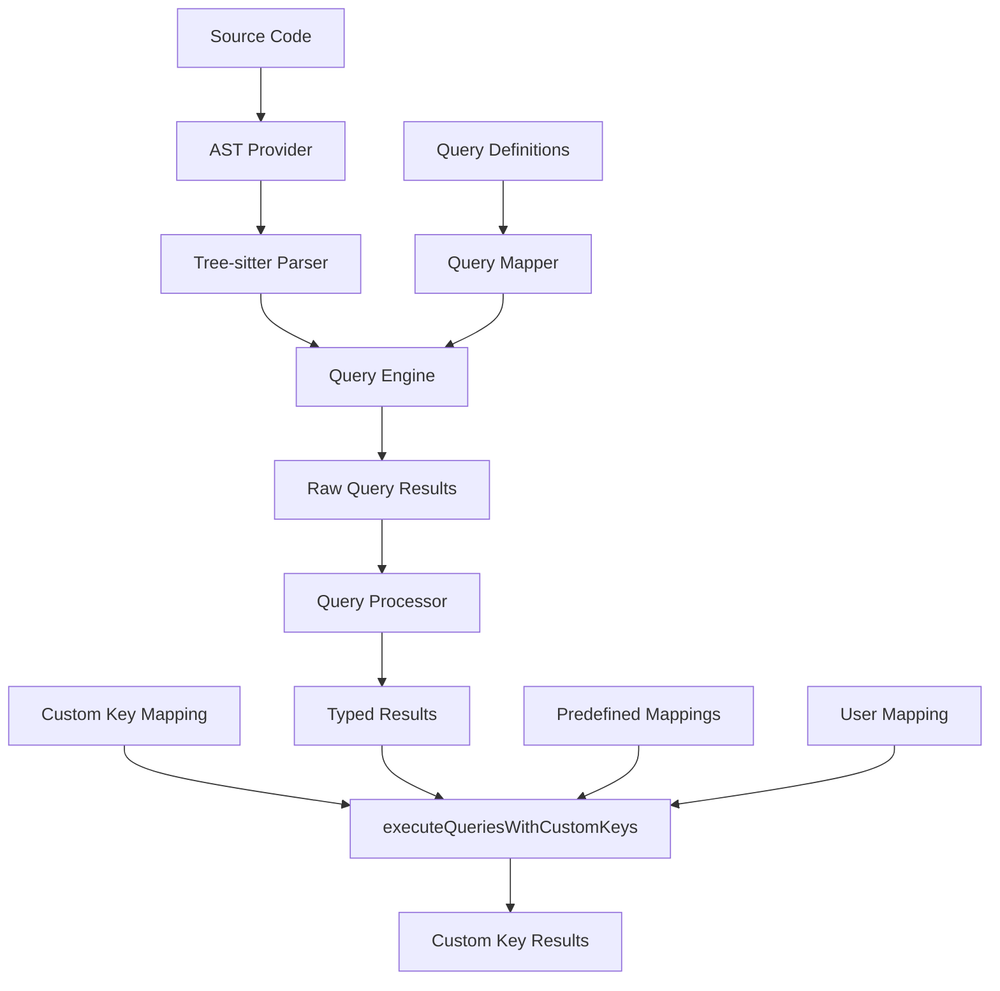
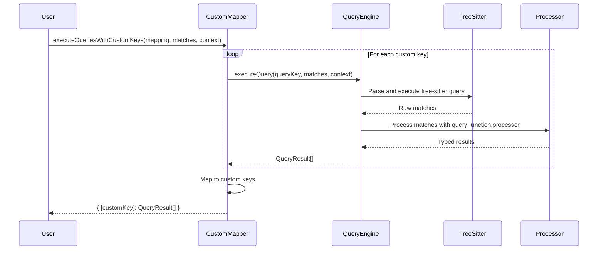

# 사용자 정의 키 매핑 시스템 가이드

이 가이드는 함수형 쿼리 시스템에서 사용자 정의 키 매핑을 확장하고 등록하는 방법을 설명합니다.

> **📖 관련 문서**: [QueryResultMap 관리 및 확장 가이드](./QUERY_RESULT_MAP_MANAGEMENT.md)에서 QueryResultMap의 구조, 타입 시스템, 확장 절차에 대한 자세한 내용을 확인하세요.

## 📋 목차

1. [쿼리 키 확장 컨벤션](#쿼리-키-확장-컨벤션)
2. [매퍼 등록 방법](#매퍼-등록-방법)
3. [데이터 플로우](#데이터-플로우)
4. [확장 예시](#확장-예시)
5. [베스트 프랙티스](#베스트-프랙티스)

## 🔑 쿼리 키 확장 컨벤션

### 기본 쿼리 키 구조

```typescript
// 기본 쿼리 키 형식: [도메인]-[대상]-[타입]
type QueryKey =
  | "import-sources"        // import 도메인, sources 대상
  | "named-imports"         // import 도메인, named 대상
  | "default-imports"       // import 도메인, default 대상
  | "type-imports"          // import 도메인, type 대상
  | "export-declarations"   // export 도메인, declarations 대상
  | "class-definitions"     // class 도메인, definitions 대상
  | "function-declarations" // function 도메인, declarations 대상
```

### 확장 컨벤션 규칙

#### 1. 명명 규칙 (Naming Convention)

```typescript
// ✅ 올바른 형식
"import-sources"          // 케밥 케이스
"export-declarations"     // 도메인-대상 구조
"class-methods"           // 구체적이고 명확한 이름

// ❌ 잘못된 형식
"importSources"           // 카멜 케이스 사용 금지
"imports"                 // 너무 일반적
"src"                     // 축약어 사용 금지
```

#### 2. 도메인 분류

```typescript
// 핵심 도메인들
const CORE_DOMAINS = {
  // 모듈 시스템
  'import': ['sources', 'named', 'default', 'type', 'namespace'],
  'export': ['declarations', 'named', 'default', 'types'],

  // 언어 구조
  'class': ['definitions', 'methods', 'properties', 'constructors'],
  'function': ['declarations', 'expressions', 'arrows', 'generators'],
  'variable': ['declarations', 'assignments', 'destructuring'],
  'type': ['definitions', 'aliases', 'interfaces', 'unions'],

  // 패턴
  'pattern': ['destructuring', 'rest', 'spread'],
  'comment': ['single-line', 'multi-line', 'jsdoc'],
  'literal': ['strings', 'numbers', 'booleans', 'arrays', 'objects']
} as const;
```

#### 3. 타입 안전성 확장

```typescript
// ImportQueries.ts에 새 쿼리 키 추가
export interface QueryResultMap {
  // 기존 쿼리들
  "import-sources": ImportSourceResult;
  "named-imports": NamedImportResult;
  "default-imports": DefaultImportResult;
  "type-imports": TypeImportResult;

  // 새로 추가되는 쿼리들
  "export-declarations": ExportDeclarationResult;
  "class-definitions": ClassDefinitionResult;
  "function-declarations": FunctionDeclarationResult;
}

// 새 쿼리 키 타입에 추가
export type QueryKey = keyof QueryResultMap;
```

## 🔧 매퍼 등록 방법

### 1. 새로운 쿼리 함수 정의

```typescript
// src/extractors/primary-analysis/queries/ImportQueries.ts

/**
 * Export Declaration 쿼리 함수
 */
export const exportDeclarationQuery: TypedQueryFunction<"export-declarations"> = {
  name: "export-declarations",
  description: "Extract export declarations from modules",
  query: `
    (export_statement
      declaration: (_) @export_declaration)
  `,
  languages: ["typescript", "tsx", "javascript", "jsx"] as const,
  priority: 95,
  resultType: "export-declarations",
  processor: (matches, context) => {
    const results: ExportDeclarationResult[] = [];

    for (const match of matches) {
      for (const capture of match.captures) {
        if (capture.name === "export_declaration") {
          results.push({
            queryName: "export-declarations",
            location: extractLocation(capture.node),
            nodeText: capture.node.text,
            exportType: capture.node.type,
            exportName: extractExportName(capture.node),
            isDefault: isDefaultExport(capture.node),
          });
        }
      }
    }

    return results;
  },
};
```

### 2. 쿼리 매퍼에 등록

> **⚠️ 중요**: QueryResultMap 확장 시 타입 안전성 보장 방법은 [QueryResultMap 관리 가이드](./QUERY_RESULT_MAP_MANAGEMENT.md#타입-안전성-보장)를 참조하세요.

```typescript
// queryMapper에 새 쿼리 추가
const createQueryMapper = () => {
  const mapper = {
    // 기존 쿼리들
    "import-sources": importSourceQuery,
    "named-imports": namedImportQuery,
    "default-imports": defaultImportQuery,
    "type-imports": typeImportQuery,

    // 새로 추가된 쿼리
    "export-declarations": exportDeclarationQuery,
    "class-definitions": classDefinitionQuery,
    "function-declarations": functionDeclarationQuery,
  } as const satisfies Record<QueryKey, TypedQueryFunction<QueryKey>>;

  return mapper;
};
```

### 3. 결과 타입 정의

```typescript
// src/extractors/primary-analysis/results/QueryResults.ts

export interface ExportDeclarationResult extends BaseQueryResult {
  queryName: "export-declarations";
  exportType: string;
  exportName: string;
  isDefault: boolean;
}

export interface ClassDefinitionResult extends BaseQueryResult {
  queryName: "class-definitions";
  className: string;
  isExported: boolean;
  superClass?: string;
  implements?: string[];
}
```

### 4. 사전 정의된 매핑 확장

```typescript
// predefinedCustomMappings에 새 패턴 추가
export const predefinedCustomMappings = {
  // 기존 매핑들
  reactAnalysis: { /* ... */ },
  jsModuleAnalysis: { /* ... */ },
  typeAnalysis: { /* ... */ },

  // 새로운 매핑들
  /**
   * 모듈 구조 전체 분석용 매핑
   */
  moduleStructureAnalysis: {
    imports: "import-sources",
    namedImports: "named-imports",
    exports: "export-declarations",
    classes: "class-definitions",
    functions: "function-declarations",
  } as const,

  /**
   * 클래스 중심 분석용 매핑
   */
  classAnalysis: {
    classes: "class-definitions",
    classImports: "import-sources",
    classExports: "export-declarations",
  } as const,

  /**
   * 함수형 프로그래밍 분석용 매핑
   */
  functionalAnalysis: {
    functions: "function-declarations",
    imports: "named-imports",
    exports: "export-declarations",
  } as const,
} as const;
```

## 📊 데이터 플로우

### 전체 시스템 아키텍처



### 상세 데이터 플로우



### 매핑 변환 과정

```typescript
// 1. 입력: 사용자 정의 매핑
const userMapping = {
  sources: "import-sources",
  classes: "class-definitions",
  functions: "function-declarations"
} as const;

// 2. 내부 처리: 쿼리 키별 실행
const internalExecution = {
  "import-sources": executeQuery("import-sources", matches, context),
  "class-definitions": executeQuery("class-definitions", matches, context),
  "function-declarations": executeQuery("function-declarations", matches, context)
};

// 3. 출력: 사용자 키로 매핑된 결과
const result = {
  sources: ImportSourceResult[],
  classes: ClassDefinitionResult[],
  functions: FunctionDeclarationResult[]
};
```

## 🚀 확장 예시

### 예시 1: React Hook 분석기 추가

```typescript
// 1. 새로운 쿼리 키와 결과 타입 정의
export interface ReactHookResult extends BaseQueryResult {
  queryName: "react-hooks";
  hookName: string;
  hookType: "useState" | "useEffect" | "useContext" | "custom";
  dependencies?: string[];
}

// 2. 쿼리 함수 구현
export const reactHookQuery: TypedQueryFunction<"react-hooks"> = {
  name: "react-hooks",
  description: "Extract React hooks usage",
  query: `
    (call_expression
      function: (identifier) @hook_name
      arguments: (_)* @hook_args
      (#match? @hook_name "^use[A-Z]"))
  `,
  languages: ["typescript", "tsx", "javascript", "jsx"] as const,
  priority: 90,
  resultType: "react-hooks",
  processor: (matches, context) => {
    // Hook 처리 로직 구현
    return results;
  },
};

// 3. 매퍼에 등록
// QueryResultMap과 queryMapper에 추가

// 4. 사전 정의 매핑 생성
export const predefinedCustomMappings = {
  // ... 기존 매핑들

  reactComponentAnalysis: {
    imports: "import-sources",
    exports: "export-declarations",
    hooks: "react-hooks",
    components: "function-declarations",
  } as const,
};
```

### 예시 2: 의존성 분석 매핑

```typescript
// 복합 분석을 위한 고급 매핑
const dependencyAnalysisMapping = {
  // 외부 의존성
  externalDeps: "import-sources",
  namedImports: "named-imports",

  // 내부 구조
  internalClasses: "class-definitions",
  internalFunctions: "function-declarations",
  exports: "export-declarations",

  // 특수 패턴
  hooks: "react-hooks",
  typeDefinitions: "type-imports",
} as const;

// 사용법
const dependencyMapper = createCustomKeyMapper(dependencyAnalysisMapping);
const analysis = dependencyMapper.execute(matches, context);

// 결과: 모든 의존성을 명확한 키로 구분하여 반환
// {
//   externalDeps: ImportSourceResult[],
//   namedImports: NamedImportResult[],
//   internalClasses: ClassDefinitionResult[],
//   internalFunctions: FunctionDeclarationResult[],
//   exports: ExportDeclarationResult[],
//   hooks: ReactHookResult[],
//   typeDefinitions: TypeImportResult[]
// }
```

### 예시 3: 조건부 분석

```typescript
// 언어별 조건부 분석
function createLanguageSpecificAnalysis(language: SupportedLanguage) {
  const baseMapping = {
    imports: "import-sources",
    functions: "function-declarations",
    exports: "export-declarations",
  };

  const typeScriptMapping = {
    ...baseMapping,
    types: "type-imports",
    classes: "class-definitions",
  };

  const reactMapping = {
    ...baseMapping,
    hooks: "react-hooks",
    components: "function-declarations",
  };

  const mapping = language.startsWith('typescript')
    ? typeScriptMapping
    : language.includes('jsx')
    ? reactMapping
    : baseMapping;

  return createCustomKeyMapper(mapping);
}

// 사용법
const tsMapper = createLanguageSpecificAnalysis("typescript");
const jsxMapper = createLanguageSpecificAnalysis("jsx");
```

## 📝 베스트 프랙티스

### 1. 쿼리 키 네이밍

```typescript
// ✅ 좋은 예시
"import-sources"          // 명확하고 구체적
"class-methods"           // 도메인과 대상이 분명
"export-declarations"     // 표준 용어 사용

// ❌ 나쁜 예시
"imports"                 // 너무 일반적
"stuff"                   // 모호함
"classMethod"             // 일관성 없는 케이스
```

### 2. 타입 안전성

```typescript
// ✅ 타입 안전한 확장
interface QueryResultMap {
  "new-query": NewQueryResult;  // 새 타입 정의
}

const newQuery: TypedQueryFunction<"new-query"> = {
  // 타입 일치하는 구현
};

// ❌ 타입 불안전한 확장
const newQuery: any = {  // any 사용 금지
  // 타입 검증 없는 구현
};
```

### 3. 성능 최적화

```typescript
// ✅ 효율적인 쿼리 우선순위
export const highPriorityQuery: TypedQueryFunction<"critical-data"> = {
  priority: 100,  // 높은 우선순위
  // 자주 사용되는 쿼리
};

export const lowPriorityQuery: TypedQueryFunction<"optional-data"> = {
  priority: 50,   // 낮은 우선순위
  // 선택적 쿼리
};
```

### 4. 문서화

```typescript
/**
 * React 컴포넌트 생명주기 분석용 쿼리
 *
 * @description 클래스 컴포넌트의 생명주기 메서드를 추출합니다
 * @supports TypeScript, JavaScript (클래스 컴포넌트만)
 * @priority 90 (일반적인 React 분석에서 중요도 높음)
 *
 * @example
 * ```typescript
 * const mapping = { lifecycle: "react-lifecycle" } as const;
 * const result = executeQueriesWithCustomKeys(mapping, matches, context);
 * // result.lifecycle: ReactLifecycleResult[]
 * ```
 */
export const reactLifecycleQuery: TypedQueryFunction<"react-lifecycle"> = {
  // 구현
};
```

### 5. 테스트 작성

```typescript
// __tests__/new-query.test.ts
describe("새로운 쿼리 시스템", () => {
  it("사용자 정의 키 매핑이 올바르게 동작해야 함", () => {
    const mapping = { customKey: "new-query" } as const;
    const result = executeQueriesWithCustomKeys(mapping, mockMatches, mockContext);

    expect(result).toHaveProperty("customKey");
    expect(Array.isArray(result.customKey)).toBe(true);
    expect(result.customKey[0]).toMatchObject({
      queryName: "new-query",
      // 예상되는 결과 구조
    });
  });
});
```

## 🔄 마이그레이션 가이드

### 기존 쿼리에서 사용자 정의 키로 마이그레이션

```typescript
// Before: 기존 방식
const sources = await engine.executeQuery("import-sources", options);
const named = await engine.executeQuery("named-imports", options);

// After: 사용자 정의 키 방식
const mapping = {
  allSources: "import-sources",
  namedImports: "named-imports"
} as const;

const result = executeQueriesWithCustomKeys(mapping, matches, context);
// result.allSources, result.namedImports로 접근
```

이 가이드를 통해 새로운 쿼리 타입을 확장하고 사용자 정의 키 매핑 시스템을 활용할 수 있습니다. 타입 안전성과 확장성을 유지하면서 직관적인 API를 제공하는 것이 핵심입니다.