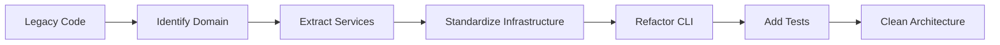

# Migration Guide: From Legacy to Clean Architecture

## Overview

This guide provides step-by-step instructions for migrating from the legacy codebase to the new Clean Architecture implementation.

## Pre-Migration Checklist

### 1. Backup Current State
```bash
# Create backup branch
git checkout -b backup/pre-clean-architecture
git push origin backup/pre-clean-architecture

# Backup configuration
cp deplink.config.json deplink.config.backup.json
```

### 2. Understand Current Dependencies
```bash
# Analyze current imports
grep -r "import.*from" src/ | sort | uniq > current-imports.txt

# Check for circular dependencies
npx madge --circular src/
```

## Migration Strategy

### Phase-by-Phase Approach



## Step-by-Step Migration

### Step 1: Project Structure Setup

Create the new architecture structure alongside existing code:

```bash
mkdir -p src/domain/{entities,services,interfaces}
mkdir -p src/services/{core,config,validation}
mkdir -p src/infrastructure/{container,notion,database,filesystem}
mkdir -p src/cli/{core,commands}
mkdir -p src/shared/{types,utils,errors}
```

### Step 2: Identify and Extract Domain Logic

#### 2.1 Identify Business Rules
Look for code that:
- Validates business constraints
- Calculates business values
- Makes business decisions
- Defines business workflows

**Example Migration**:
```typescript
// BEFORE: Mixed concerns in uploadService.ts
export async function uploadFile(filePath: string) {
  // Business logic mixed with infrastructure
  if (file.size > 1048576) { // Business rule
    throw new Error('File too large');
  }
  
  // Direct infrastructure call
  const page = await notionClient.pages.create({...});
}

// AFTER: Separated concerns
// domain/entities/DataCollectionRules.ts
export class DataCollectionRules {
  validateFileSize(file: ProjectFile): boolean {
    return file.size <= this.config.parser.maxFileSize;
  }
}

// services/uploadService.ts
export class UploadService {
  async uploadFile(filePath: string) {
    // Use domain entity for validation
    if (!this.rules.validateFileSize(file)) {
      throw new DomainError('File exceeds size limit');
    }
    
    // Use injected service for infrastructure
    return await this.notionService.createPage(data);
  }
}
```

#### 2.2 Create Domain Entities

Transform data structures into domain entities with behavior:

```typescript
// BEFORE: Plain data structure
interface ProjectInfo {
  name: string;
  type: string;
  path: string;
}

// AFTER: Domain entity with behavior
export class Project {
  constructor(
    private name: string,
    private type: ProjectType,
    private path: string
  ) {
    this.validate();
  }
  
  private validate(): void {
    if (!this.name) throw new DomainError('Project name required');
    if (!this.isValidPath(this.path)) throw new DomainError('Invalid path');
  }
  
  detectFramework(): Framework {
    // Business logic for framework detection
  }
  
  getConfigurationPath(): string {
    return path.join(this.path, 'deplink.config.json');
  }
}
```

### Step 3: Standardize Infrastructure Layer

#### 3.1 Create Adapters for External Services

```typescript
// BEFORE: Direct Notion client usage
import { Client } from '@notionhq/client';
const notion = new Client({ auth: apiKey });
await notion.pages.create({...});

// AFTER: Abstracted through adapter
// infrastructure/notion/core/NotionApiService.ts
export class NotionApiService implements INotionService {
  constructor(private clientInstance: INotionClientInstance) {}
  
  async createPage(data: PageData): Promise<Result<Page>> {
    return this.requestHandler.executeRequest(
      'createPage',
      () => this.client.pages.create(data),
      { retries: 3, timeout: 5000 }
    );
  }
}
```

#### 3.2 Implement Repository Pattern

```typescript
// BEFORE: Direct database access
const db = new Database('file.db');
const files = db.prepare('SELECT * FROM files').all();

// AFTER: Repository abstraction
export class FileRepository implements IFileRepository {
  constructor(private db: IDatabase) {}
  
  async findAll(): Promise<ProjectFile[]> {
    return this.db.query<ProjectFile>('files').all();
  }
  
  async save(file: ProjectFile): Promise<void> {
    await this.db.insert('files', file);
  }
}
```

### Step 4: Refactor Application Services

#### 4.1 Create Service Base Class

```typescript
// services/core/BaseApplicationService.ts
export abstract class BaseApplicationService {
  protected async executeOperation<T>(
    operationName: string,
    operation: () => Promise<T>,
    options?: OperationOptions
  ): Promise<T> {
    const startTime = Date.now();
    
    try {
      logger.debug(`${this.serviceName}.${operationName} started`);
      const result = await operation();
      
      this.recordMetric(operationName, {
        success: true,
        duration: Date.now() - startTime
      });
      
      return result;
    } catch (error) {
      this.handleError(operationName, error);
      throw error;
    }
  }
}
```

#### 4.2 Migrate Service Logic

```typescript
// BEFORE: Procedural service
export async function syncProject(projectPath: string) {
  const files = await fs.readdir(projectPath);
  // ... lots of mixed logic
}

// AFTER: Object-oriented service
export class SyncService extends BaseApplicationService {
  constructor(dependencies: ServiceDependencies) {
    super(dependencies, 'SyncService');
  }
  
  async syncProject(projectPath: string): Promise<SyncResult> {
    return this.executeOperation('syncProject', async () => {
      // Orchestrate domain and infrastructure
      const project = await this.projectService.loadProject(projectPath);
      const files = await this.fileRepository.findByProject(project.id);
      return await this.notionSync.synchronize(files);
    });
  }
}
```

### Step 5: Implement Dependency Injection

#### 5.1 Create Service Container

```typescript
// infrastructure/container/ServiceContainer.ts
export class ServiceContainer {
  private services = new Map<string, any>();
  private factories = new Map<string, () => any>();
  
  register<T>(token: string, factory: () => T): void {
    this.factories.set(token, factory);
  }
  
  resolve<T>(token: string): T {
    if (!this.services.has(token)) {
      const factory = this.factories.get(token);
      if (!factory) throw new Error(`Service ${token} not registered`);
      this.services.set(token, factory());
    }
    return this.services.get(token);
  }
}
```

#### 5.2 Configure Dependencies

```typescript
// infrastructure/container/containerConfig.ts
export function configureContainer(): ServiceContainer {
  const container = new ServiceContainer();
  
  // Register infrastructure
  container.register('configService', () => 
    new ConfigurationService()
  );
  
  container.register('notionClient', () => {
    const config = container.resolve<ConfigurationService>('configService');
    return NotionClientFactory.createClient(config.getNotionConfig());
  });
  
  // Register services
  container.register('uploadService', () => 
    new UploadService({
      configService: container.resolve('configService'),
      notionApiService: container.resolve('notionClient')
    })
  );
  
  return container;
}
```

### Step 6: Refactor CLI Commands

#### 6.1 Standardize Command Structure

```typescript
// BEFORE: Direct implementation
program
  .command('upload <file>')
  .action(async (file) => {
    // Direct logic here
    const config = await loadConfig();
    const notion = new Client({ auth: config.apiKey });
    // ...
  });

// AFTER: Dependency injection
const uploadCommand = createStandardizedCommand(
  'upload',
  'Upload files to Notion',
  { requiresNotion: true, validateConfig: true },
  async (deps: CommandDependencies, options: any) => {
    const uploadService = deps.container.resolve<UploadService>('uploadService');
    const result = await uploadService.uploadFile(options.file);
    logger.success(`Uploaded: ${result.pageUrl}`);
  }
);
```

### Step 7: Add Comprehensive Tests

#### 7.1 Unit Tests for Domain Logic

```typescript
// test/unit/domain/ProjectExploration.test.ts
describe('ProjectExploration', () => {
  it('should detect TypeScript project', () => {
    const exploration = new ProjectExploration(mockConfig);
    const result = exploration.detectProjectType(mockFiles);
    expect(result.type).toBe('typescript');
    expect(result.confidence).toBeGreaterThan(0.8);
  });
});
```

#### 7.2 Integration Tests

```typescript
// test/integration/NotionApiService.test.ts
describe('NotionApiService Integration', () => {
  it('should handle rate limiting gracefully', async () => {
    const service = new NotionApiService(mockClient);
    // Simulate rate limit scenario
    const results = await Promise.all(
      Array(10).fill(null).map(() => service.createPage(data))
    );
    expect(results.every(r => r.success)).toBe(true);
  });
});
```

## Migration Validation

### 1. Architecture Compliance Check

Run the architecture compliance tests:

```bash
npm test -- test/architecture/CleanArchitecture.compliance.test.ts
```

### 2. Dependency Analysis

```bash
# Check for layer violations
npx madge --circular src/
npx madge --image graph.svg src/

# Verify no outward dependencies from domain
grep -r "import.*infrastructure" src/domain/
grep -r "import.*services" src/domain/
```

### 3. Test Coverage

```bash
# Run all tests with coverage
npm test -- --coverage

# Ensure minimum coverage
# Domain: >90%
# Services: >80%
# Infrastructure: >70%
# CLI: >60%
```

## Common Migration Issues and Solutions

### Issue 1: Circular Dependencies

**Problem**: Existing code has circular dependencies
```typescript
// FileA imports FileB
// FileB imports FileA
```

**Solution**: Introduce interfaces and dependency inversion
```typescript
// Define interface in domain
export interface IFileProcessor {
  process(file: File): Promise<void>;
}

// Implement in infrastructure
export class FileProcessor implements IFileProcessor {
  process(file: File): Promise<void> {
    // Implementation
  }
}
```

### Issue 2: Tightly Coupled Services

**Problem**: Services directly instantiate dependencies
```typescript
class ServiceA {
  private serviceB = new ServiceB(); // Direct coupling
}
```

**Solution**: Use constructor injection
```typescript
class ServiceA {
  constructor(private serviceB: IServiceB) {} // Injected dependency
}
```

### Issue 3: Business Logic in Wrong Layer

**Problem**: Business rules in infrastructure or UI
```typescript
// In CLI command
if (file.size > 1048576) { // Business rule in UI
  console.error('File too large');
}
```

**Solution**: Move to domain layer
```typescript
// In domain entity
class FileValidation {
  static validateSize(file: File): ValidationResult {
    if (file.size > MAX_FILE_SIZE) {
      return ValidationResult.error('File exceeds maximum size');
    }
    return ValidationResult.success();
  }
}
```

## Post-Migration Tasks

### 1. Update Documentation
- Update README with new architecture
- Document new CLI commands
- Update API documentation
- Create onboarding guide

### 2. Team Training
- Conduct architecture workshop
- Review SOLID principles
- Practice test-driven development
- Establish code review guidelines

### 3. Continuous Improvement
- Monitor code metrics
- Regular architecture reviews
- Refactor legacy code gradually
- Maintain test coverage

## Rollback Plan

If issues arise during migration:

### 1. Immediate Rollback
```bash
# Revert to backup branch
git checkout backup/pre-clean-architecture
git checkout -b main-rollback
git push origin main-rollback

# Restore configuration
cp deplink.config.backup.json deplink.config.json
```

### 2. Partial Rollback
Keep Clean Architecture structure but restore specific functionality:
```bash
# Cherry-pick working commits
git cherry-pick <commit-hash>

# Or restore specific files
git checkout backup/pre-clean-architecture -- src/specific-file.ts
```

### 3. Gradual Migration
Maintain both architectures temporarily:
```typescript
// Use feature flags
if (process.env.USE_CLEAN_ARCHITECTURE === 'true') {
  return container.resolve<UploadService>('uploadService').upload(file);
} else {
  return legacyUploadFile(file); // Old implementation
}
```

## Success Metrics

### Technical Metrics
- **Test Coverage**: >80% overall
- **Build Time**: <2 minutes
- **Circular Dependencies**: 0
- **Code Duplication**: <5%

### Quality Metrics
- **Bug Rate**: Decreased by 50%
- **Feature Velocity**: Increased by 30%
- **Code Review Time**: Decreased by 40%
- **Onboarding Time**: Decreased by 50%

## Support and Resources

### Internal Resources
- Architecture Decision Records (ADRs)
- Team Wiki
- Code Examples
- Pair Programming Sessions

### External Resources
- [Clean Architecture Book](https://www.amazon.com/Clean-Architecture-Craftsmans-Software-Structure/dp/0134494164)
- [Domain-Driven Design](https://www.dddcommunity.org/)
- [SOLID Principles](https://www.digitalocean.com/community/conceptual_articles/s-o-l-i-d-the-first-five-principles-of-object-oriented-design)
- [Dependency Injection](https://www.martinfowler.com/articles/injection.html)

## Conclusion

This migration guide provides a systematic approach to transforming legacy code into Clean Architecture. Follow the phases sequentially, validate each step, and maintain comprehensive tests throughout the process.