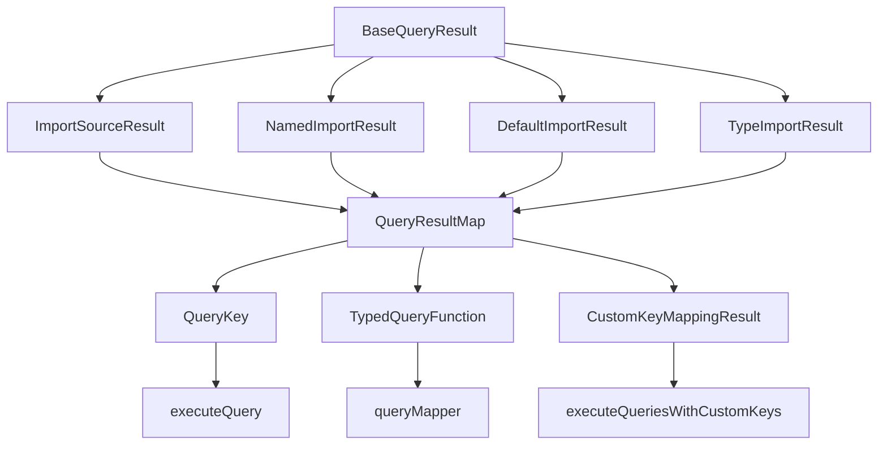

# QueryResultMap 관리 및 확장 가이드

이 문서는 함수형 쿼리 시스템의 핵심인 `QueryResultMap` 인터페이스의 관리, 확장, 그리고 타입 안전성 유지 방법을 설명합니다.

## 📋 목차

1. [QueryResultMap 구조 이해](#queryresultmap-구조-이해)
2. [타입 시스템 아키텍처](#타입-시스템-아키텍처)
3. [확장 절차 및 방법](#확장-절차-및-방법)
4. [타입 안전성 보장](#타입-안전성-보장)
5. [충돌 해결 및 호환성](#충돌-해결-및-호환성)
6. [마이그레이션 전략](#마이그레이션-전략)
7. [모니터링 및 검증](#모니터링-및-검증)

## 🏗️ QueryResultMap 구조 이해

### 핵심 인터페이스 정의

```typescript
// src/extractors/primary-analysis/queries/ImportQueries.ts
export interface QueryResultMap {
    "import-sources": ImportSourceResult;
    "named-imports": NamedImportResult;
    "default-imports": DefaultImportResult;
    "type-imports": TypeImportResult;
}

export type QueryKey = keyof QueryResultMap;
export type TypedQueryFunction<K extends QueryKey> = QueryFunction<QueryResultMap[K]>;
```

### 구조적 특징

1. **키-값 매핑**: 각 쿼리 키는 특정 결과 타입과 1:1 매핑
2. **타입 추론**: `QueryKey`로부터 결과 타입 자동 추론
3. **확장성**: 새로운 키-타입 쌍을 안전하게 추가 가능
4. **일관성**: 모든 결과 타입은 `BaseQueryResult` 확장

### 의존성 관계



## 🔧 타입 시스템 아키텍처

### 1. 계층적 타입 구조

```typescript
// 기본 결과 타입
interface BaseQueryResult {
    queryName: string;
    location: ExtendedSourceLocation;
    nodeText: string;
}

// 구체적 결과 타입들
interface ImportSourceResult extends BaseQueryResult {
    queryName: "import-sources";
    source: string;
    isRelative: boolean;
    fileExtension?: string;
}

interface NamedImportResult extends BaseQueryResult {
    queryName: "named-imports";
    name: string;
    alias?: string;
    source: string;
}
```

### 2. 타입 제약 시스템

```typescript
// 타입 안전성 보장을 위한 제약들
type ValidQueryKey = keyof QueryResultMap;
type ValidResultType<K extends ValidQueryKey> = QueryResultMap[K];

// 컴파일 타임 검증
type TypeCheck<K extends ValidQueryKey> =
    QueryResultMap[K] extends BaseQueryResult ? true : never;
```

### 3. 동적 타입 매핑

```typescript
// 사용자 정의 키 매핑에서의 타입 추론
type CustomKeyMappingResult<TMapping extends Record<string, QueryKey>> = {
    [K in keyof TMapping]: QueryResultMap[TMapping[K]][];
};
```

## 📈 확장 절차 및 방법

### Step 1: 결과 타입 정의

```typescript
// src/extractors/primary-analysis/results/QueryResults.ts
export interface ExportDeclarationResult extends BaseQueryResult {
    queryName: "export-declarations";
    exportType: "named" | "default" | "namespace";
    exportName: string;
    isDefault: boolean;
    source?: string;
}
```

### Step 2: QueryResultMap 확장

```typescript
// src/extractors/primary-analysis/queries/ImportQueries.ts
export interface QueryResultMap {
    // 기존 쿼리들
    "import-sources": ImportSourceResult;
    "named-imports": NamedImportResult;
    "default-imports": DefaultImportResult;
    "type-imports": TypeImportResult;

    // 새로 추가되는 쿼리
    "export-declarations": ExportDeclarationResult;
}
```

### Step 3: 쿼리 함수 구현

```typescript
export const exportDeclarationQuery: TypedQueryFunction<"export-declarations"> = {
    name: "export-declarations",
    description: "Extract export declarations from modules",
    query: `(export_statement declaration: (_) @export_declaration)`,
    languages: ["typescript", "tsx", "javascript", "jsx"] as const,
    priority: 95,
    resultType: "export-declarations",
    processor: (matches, context) => {
        // 프로세서 구현
        return results;
    },
};
```

### Step 4: 매퍼 등록

```typescript
// queryMapper에 새 쿼리 추가
const createQueryMapper = () => {
    const mapper = {
        // 기존 쿼리들
        "import-sources": importSourceQuery,
        "named-imports": namedImportQuery,
        "default-imports": defaultImportQuery,
        "type-imports": typeImportQuery,

        // 새로 추가된 쿼리
        "export-declarations": exportDeclarationQuery,
    } as const satisfies Record<QueryKey, TypedQueryFunction<QueryKey>>;

    return mapper;
};
```

### Step 5: 타입 검증

```typescript
// 컴파일 타임 타입 검증
type VerifyQueryMapper = typeof queryMapper;
type VerifyKeys = keyof VerifyQueryMapper extends QueryKey ? true : false;
type VerifyValues<K extends QueryKey> =
    typeof queryMapper[K] extends TypedQueryFunction<K> ? true : false;
```

## 🛡️ 타입 안전성 보장

### 1. 컴파일 타임 검증

```typescript
// 타입 일관성 검증 유틸리티
type ValidateQueryResultMap<T extends Record<string, any>> = {
    [K in keyof T]: T[K] extends BaseQueryResult
        ? T[K]['queryName'] extends K
            ? T[K]
            : never
        : never;
};

// 사용 예시
type ValidatedMap = ValidateQueryResultMap<QueryResultMap>;
```

### 2. 런타임 검증

```typescript
// 런타임 타입 가드
function isValidQueryResult<K extends QueryKey>(
    result: any,
    expectedQueryName: K
): result is QueryResultMap[K] {
    return (
        typeof result === 'object' &&
        result !== null &&
        result.queryName === expectedQueryName &&
        'location' in result &&
        'nodeText' in result
    );
}

// 결과 검증 함수
function validateQueryResults<K extends QueryKey>(
    results: unknown[],
    queryKey: K
): QueryResultMap[K][] {
    return results.filter((result): result is QueryResultMap[K] =>
        isValidQueryResult(result, queryKey)
    );
}
```

### 3. 개발 시점 검증

```typescript
// 개발용 타입 체크 유틸리티
export function checkQueryMapIntegrity(): void {
    const mapper = queryMapper;
    const keys = Object.keys(mapper) as QueryKey[];

    for (const key of keys) {
        const query = mapper[key];
        if (query.resultType !== key) {
            throw new Error(`Query ${key} has mismatched resultType: ${query.resultType}`);
        }
    }
}
```

## ⚖️ 충돌 해결 및 호환성

### 1. 키 이름 충돌 방지

```typescript
// 키 네이밍 컨벤션 검증
type ValidKeyFormat<T extends string> = T extends `${string}-${string}`
    ? T extends `${infer Domain}-${infer Target}`
        ? Domain extends CoreDomain
            ? Target extends ValidTarget
                ? T
                : never
            : never
        : never
    : never;

type CoreDomain = "import" | "export" | "class" | "function" | "variable" | "type";
type ValidTarget = "sources" | "declarations" | "definitions" | "expressions";
```

### 2. 하위 호환성 유지

```typescript
// 마이그레이션 지원을 위한 별칭
type LegacyQueryResultMap = {
    // 구 버전 호환성
    "imports": ImportSourceResult; // deprecated: use "import-sources"
    "exports": ExportDeclarationResult; // deprecated: use "export-declarations"
};

// 점진적 마이그레이션 지원
type ExtendedQueryResultMap = QueryResultMap & Partial<LegacyQueryResultMap>;
```

### 3. 버전 관리 전략

```typescript
// 버전별 QueryResultMap 관리
namespace QueryResultMapVersions {
    export interface V1 {
        "import-sources": ImportSourceResult;
        "named-imports": NamedImportResult;
    }

    export interface V2 extends V1 {
        "default-imports": DefaultImportResult;
        "type-imports": TypeImportResult;
    }

    export interface V3 extends V2 {
        "export-declarations": ExportDeclarationResult;
        "class-definitions": ClassDefinitionResult;
    }

    // 현재 버전 별칭
    export type Current = V3;
}

export type QueryResultMap = QueryResultMapVersions.Current;
```

## 🔄 마이그레이션 전략

### 1. 점진적 추가 방식

```typescript
// 1단계: 새 타입 정의
interface NewQueryResult extends BaseQueryResult {
    queryName: "new-query";
    // 새 속성들
}

// 2단계: 선택적 확장
interface ExtendedQueryResultMap extends QueryResultMap {
    "new-query"?: NewQueryResult; // 선택적 속성으로 시작
}

// 3단계: 필수 속성으로 전환
interface FinalQueryResultMap extends QueryResultMap {
    "new-query": NewQueryResult; // 필수 속성으로 확정
}
```

### 2. 폐기 예정 쿼리 관리

```typescript
// 폐기 예정 마킹
interface DeprecatedQueries {
    /** @deprecated Use "import-sources" instead */
    "imports": ImportSourceResult;

    /** @deprecated Use "export-declarations" instead */
    "exports": ExportDeclarationResult;
}

// 경고와 함께 지원
type QueryResultMapWithDeprecated = QueryResultMap & DeprecatedQueries;
```

### 3. 자동 마이그레이션 도구

```typescript
// 마이그레이션 매퍼
const migrationMap: Record<string, QueryKey> = {
    "imports": "import-sources",
    "exports": "export-declarations",
    "classes": "class-definitions",
    "functions": "function-declarations",
};

// 자동 변환 함수
function migrateQueryKey(oldKey: string): QueryKey | null {
    const newKey = migrationMap[oldKey];
    if (newKey) {
        console.warn(`Query key "${oldKey}" is deprecated. Use "${newKey}" instead.`);
        return newKey;
    }
    return oldKey as QueryKey;
}
```

## 📊 모니터링 및 검증

### 1. 타입 커버리지 검증

```typescript
// 모든 쿼리 키가 매퍼에 등록되었는지 확인
type UnmappedQueries = Exclude<QueryKey, keyof typeof queryMapper>;
type CoverageCheck = UnmappedQueries extends never ? true : false;

// 컴파일 타임 어설션
const _coverageCheck: CoverageCheck = true; // 타입 에러 시 미등록 쿼리 존재
```

### 2. 런타임 무결성 검사

```typescript
// 시스템 부팅시 무결성 검사
export function validateQuerySystem(): ValidationResult {
    const errors: string[] = [];
    const warnings: string[] = [];

    // 1. 모든 쿼리 키 등록 확인
    const registeredKeys = Object.keys(queryMapper) as QueryKey[];
    const definedKeys = Object.keys({} as QueryResultMap) as QueryKey[];

    for (const key of definedKeys) {
        if (!registeredKeys.includes(key)) {
            errors.push(`Query key "${key}" is not registered in queryMapper`);
        }
    }

    // 2. 결과 타입 일관성 확인
    for (const [key, query] of Object.entries(queryMapper)) {
        if (query.resultType !== key) {
            errors.push(`Query "${key}" has inconsistent resultType: ${query.resultType}`);
        }
    }

    // 3. 언어 지원 검증
    for (const [key, query] of Object.entries(queryMapper)) {
        if (query.languages.length === 0) {
            warnings.push(`Query "${key}" has no supported languages`);
        }
    }

    return { errors, warnings, isValid: errors.length === 0 };
}

interface ValidationResult {
    errors: string[];
    warnings: string[];
    isValid: boolean;
}
```

### 3. 성능 모니터링

```typescript
// 쿼리별 성능 메트릭
interface QueryMetrics {
    executionCount: number;
    totalExecutionTime: number;
    averageExecutionTime: number;
    errorCount: number;
    lastExecuted: Date;
}

class QueryPerformanceMonitor {
    private metrics = new Map<QueryKey, QueryMetrics>();

    recordExecution<K extends QueryKey>(
        queryKey: K,
        executionTime: number,
        resultCount: number,
        hasError: boolean = false
    ): void {
        const current = this.metrics.get(queryKey) || this.createEmptyMetrics();

        current.executionCount++;
        current.totalExecutionTime += executionTime;
        current.averageExecutionTime = current.totalExecutionTime / current.executionCount;
        current.lastExecuted = new Date();

        if (hasError) {
            current.errorCount++;
        }

        this.metrics.set(queryKey, current);
    }

    getMetrics(queryKey?: QueryKey): QueryMetrics | Map<QueryKey, QueryMetrics> {
        if (queryKey) {
            return this.metrics.get(queryKey) || this.createEmptyMetrics();
        }
        return new Map(this.metrics);
    }

    private createEmptyMetrics(): QueryMetrics {
        return {
            executionCount: 0,
            totalExecutionTime: 0,
            averageExecutionTime: 0,
            errorCount: 0,
            lastExecuted: new Date()
        };
    }
}
```

## 🎯 베스트 프랙티스

### 1. 설계 원칙

```typescript
// ✅ 올바른 설계
interface WellDesignedResult extends BaseQueryResult {
    queryName: "specific-feature"; // 구체적이고 명확
    // 필수 속성들
    primaryData: string;
    // 선택적 속성들
    optionalMetadata?: Record<string, any>;
}

// ❌ 잘못된 설계
interface PoorlyDesignedResult extends BaseQueryResult {
    queryName: "stuff"; // 너무 일반적
    data: any; // 타입 안전성 부족
    everything?: unknown; // 모호한 속성
}
```

### 2. 확장 가이드라인

```typescript
// ✅ 점진적 확장
interface QueryResultMap {
    // 기존 안정 버전
    "import-sources": ImportSourceResult;

    // 새 기능 (실험적)
    "advanced-imports"?: AdvancedImportResult;
}

// ✅ 명확한 의존성
interface DependentResult extends BaseQueryResult {
    queryName: "dependent-analysis";
    baseData: ImportSourceResult; // 다른 쿼리 결과 재사용
    derivedData: string;
}
```

### 3. 문서화 표준

```typescript
/**
 * React Hook 분석 결과
 *
 * @description React 훅의 사용 패턴과 의존성을 분석합니다
 * @supports TypeScript, JavaScript (React 프로젝트)
 * @since v2.5.0
 * @stability stable
 *
 * @example
 * ```typescript
 * const mapping = { hooks: "react-hooks" } as const;
 * const result = executeQueriesWithCustomKeys(mapping, matches, context);
 * // result.hooks: ReactHookResult[]
 * ```
 */
interface ReactHookResult extends BaseQueryResult {
    queryName: "react-hooks";
    hookName: string;
    hookType: "useState" | "useEffect" | "useContext" | "custom";
    dependencies?: string[];
    isCustomHook: boolean;
}
```

## 🔧 개발 도구 및 유틸리티

### 1. 코드 생성 도구

```typescript
// 새 쿼리 타입 생성 템플릿
function generateQueryResultInterface(
    queryName: string,
    properties: Record<string, string>
): string {
    const propertyDefs = Object.entries(properties)
        .map(([key, type]) => `    ${key}: ${type};`)
        .join('\n');

    return `
interface ${toPascalCase(queryName)}Result extends BaseQueryResult {
    queryName: "${queryName}";
${propertyDefs}
}`;
}

// 사용 예시
const newInterface = generateQueryResultInterface("class-methods", {
    className: "string",
    methodName: "string",
    isStatic: "boolean",
    visibility: '"public" | "private" | "protected"'
});
```

### 2. 검증 도구

```typescript
// QueryResultMap 무결성 검사 CLI 도구
function validateProjectQueries(projectPath: string): void {
    const sourceFiles = findTypeScriptFiles(projectPath);
    const queryMaps = extractQueryResultMaps(sourceFiles);

    for (const map of queryMaps) {
        const validation = validateQueryResultMap(map);
        if (!validation.isValid) {
            console.error(`Validation failed for ${map.file}:`);
            validation.errors.forEach(error => console.error(`  - ${error}`));
        }
    }
}
```

이 문서를 통해 QueryResultMap의 체계적인 관리와 안전한 확장이 가능합니다. 타입 안전성을 유지하면서도 시스템의 확장성과 유지보수성을 보장하는 것이 핵심입니다.