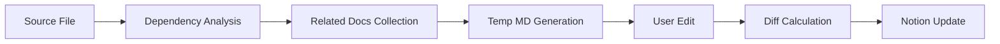

# Dependency Linker - Implementation Roadmap

## 📋 Executive Summary

Dependency Linker는 코드베이스의 문서와 코드 의존성을 Notion 데이터베이스로 관리하는 **개발 도구 라이브러리**입니다. `npm install -D dependency-linker`로 설치되어 프로젝트 개발 환경에서 실행되며, 린트나 프리티어와 같은 방식으로 동작합니다. 이 문서는 `src/`에서 `src/`로의 마이그레이션 및 고도화된 기능 구현을 위한 상세 로드맵을 제공합니다.

### 핵심 목표
- **개발 도구 통합**: npm devDependency로 설치되어 프로젝트 루트에서 실행
- **자동 프로젝트 탐지**: package.json 기반 프로젝트 루트 자동 식별
- **통합 의존성 관리**: 코드와 문서 간 의존성을 Notion에서 중앙 관리
- **컨텍스트 엔지니어링**: 개발 시 필요한 관련 문서 자동 수집 및 제공
- **스키마 기반 확장**: JSON 스키마를 통한 유연한 데이터베이스 정의
- **API 최적화**: Notion API 제약사항을 극복하는 지능형 동기화

### 설치 및 사용 모델
```bash
# 개발 의존성으로 설치
npm install -D dependency-linker

# 프로젝트 초기화 (config 파일 생성)
npx deplink init
# → 프로젝트 루트에 deplink.config.json 생성
# → .env.example 생성 및 .env 설정 가이드 제공

# 환경 설정 (.env 파일 생성 프로세스)
npx deplink setup
# → Notion API 키 입력 프로세스
# → .env 파일 생성 및 .gitignore 업데이트

# 일반적인 사용
npx deplink sync      # Notion 동기화
npx deplink analyze   # 의존성 분석
npx deplink context   # 컨텍스트 수집
```

### 프로젝트 파일 구조
```
your-project/
├── package.json              # deplink이 프로젝트 루트 탐지에 사용
├── deplink.config.json        # 생성됨: 프로젝트별 설정
├── .env                       # 생성됨: Notion API 키 등
├── .deplink/                  # 생성됨: 내부 데이터 저장소
│   ├── mappings.db           # SQLite: ID 매핑, 의존성 인덱스
│   └── cache/                # 임시 파일 캐시
└── src/
    └── your-code.ts
```

## 🏗️ Architecture Overview

### Clean Architecture Layers

```
src/
├── domain/            # 핵심 비즈니스 로직 (의존성 없음)
├── infrastructure/    # 외부 시스템 연동 (Notion, SQLite, FileSystem)
├── services/         # 비즈니스 로직 조율 및 워크플로우
├── cli/             # 사용자 인터페이스 및 명령어
└── shared/          # 공통 유틸리티 및 타입
```

### 기술 스택
- **Distribution**: NPM Package (devDependency)
- **Runtime**: Node.js/Bun 호환
- **Language**: TypeScript (강타입 시스템)
- **Database**: Bun SQLite (`bun:sqlite`, 로컬 인덱싱), Notion (클라우드 저장소)
- **Parser**: TypeScript AST, Markdown Parser
- **Project Detection**: package.json, git root, manual override
- **No External SQLite Dependencies**: Bun의 네이티브 SQLite 바인딩 활용

## 📊 Implementation Phases

### Phase 1: Core Infrastructure (1-2주)

#### 목표
- **프로젝트 루트 탐지**: package.json, .git 기반 자동 식별
- **설정 파일 관리**: 프로젝트 루트의 config 파일 생성/관리
- **환경 변수 처리**: .env 파일 생성 및 보안 관리
- **Notion 데이터베이스 ID 매핑 관리**
- **SQLite 마이그레이션 기반 구축**

#### 주요 모듈
- `projectDetector`: 프로젝트 루트 자동 탐지 (package.json, .git)
- `configManager`: 프로젝트별 설정 관리 (deplink.config.json)
- `envManager`: .env 파일 생성 및 관리 프로세스
- `schemaValidator`: JSON 스키마 검증
- `notionIdManager`: 데이터베이스/속성 ID 영속화
- `migrationManager`: 스키마 버전 관리

### Phase 2: Dependency Analysis Engine (2-3주)

#### 목표
- AST 기반 정확한 의존성 분석
- 라이브러리 vs 내부 모듈 자동 분류
- 의존성 그래프 생성 및 순환 참조 탐지

#### 주요 모듈
- `codeParser`: TypeScript/JavaScript AST 분석
- `markdownParser`: Front-matter 및 링크 추출
- `graphBuilder`: 의존성 그래프 구축
- `aliasResolver`: 경로 별칭 해석

### Phase 3: Notion Integration System (3-4주)

#### 목표
- Notion API 추상화 계층 구축
- Rate limiting 및 재시도 메커니즘
- 대용량 컨텐츠 청킹 시스템

#### 주요 모듈
- `notionClient`: API 클라이언트 래퍼
- `rateLimiter`: 지능형 속도 제한 관리
- `blockChunker`: 2000자 제한 대응 분할
- `retryManager`: Exponential backoff 구현

### Phase 4: Document Management System (2-3주)

#### 목표
- 문서 식별자 시스템 구축
- 임시 MD 파일 워크플로우
- 컨텍스트 수집 및 제공

#### 주요 모듈
- `documentTracker`: 문서 ID 관리 및 추적
- `contextAssembler`: 연관 문서 수집
- `tempFileManager`: 임시 파일 생성/관리
- `recoveryManager`: 삭제 문서 복구

### Phase 5: CLI and User Interface (1주)

#### 목표
- 직관적인 CLI 명령어 체계
- 다양한 출력 포맷 지원
- 진행 상황 시각화

#### 주요 명령어
- `deplink init`: 프로젝트 초기화
- `deplink sync`: Notion 동기화
- `deplink analyze`: 의존성 분석
- `deplink context`: 컨텍스트 관리

### Phase 5.5: Advanced Features (2-3주)

#### 목표
- Differential sync 시스템
- 블록 레벨 업데이트
- 충돌 해결 메커니즘

#### 주요 모듈
- `blockDiffer`: Myers diff 알고리즘
- `patchGenerator`: 최소 변경 패치
- `conflictResolver`: 자동 충돌 해결

## 🔧 Technical Specifications

### Notion API Constraints

```typescript
interface NotionApiLimits {
  rateLimit: {
    requestsPerSecond: 3;
    retryAfter: 'exponential-backoff';
  };
  payload: {
    maxBlockSize: 2000;        // 문자
    maxBlocksPerRequest: 100;  // 블록
    requestTimeout: 60;         // 초
  };
}
```

### Schema Definition Format

```json
{
  "$schema": "https://json-schema.org/draft/2020-12/schema",
  "databases": {
    "[database-key]": {
      "title": "Database Title",
      "properties": {
        "[property-key]": {
          "type": "title|rich_text|select|relation|...",
          "required": true|false,
          "options": [...],
          "automation": {
            "filePath": true,
            "dependencies": true,
            "libraryDetection": true
          }
        }
      }
    }
  }
}
```

### Context Engineering Workflow



## 📈 Performance Metrics

### Target KPIs

| Metric | Target | Description |
|--------|--------|-------------|
| API Efficiency | >95% | Rate limit 활용률 |
| Sync Speed | <5s/doc | 문서당 동기화 시간 |
| Context Assembly | <3s | 컨텍스트 수집 시간 |
| Diff Reduction | >70% | 변경 패치 크기 감소 |
| Recovery Rate | >99% | 삭제 문서 복구 성공률 |

### Monitoring Dashboard

```typescript
interface PerformanceMetrics {
  api: {
    requestCount: number;
    rateLimitHits: number;
    retryCount: number;
    avgResponseTime: number;
  };
  sync: {
    documentsProcessed: number;
    blocksUpdated: number;
    failureRate: number;
  };
  cache: {
    hitRate: number;
    size: number;
    evictionCount: number;
  };
}
```

## 🚀 Migration Strategy

### From src/ to src/

1. **Feature-by-Feature Migration**
   - 핵심 기능부터 순차적 이전
   - 기존 API 호환성 유지
   - 점진적 기능 교체

2. **Data Migration**
   - 기존 SQLite 데이터 보존
   - 스키마 자동 업그레이드
   - 롤백 메커니즘 구현

3. **Testing Strategy**
   - Unit tests: 개별 모듈 검증
   - Integration tests: 워크플로우 검증
   - E2E tests: 전체 시스템 검증

## 📅 Timeline

| Week | Phase | Deliverables |
|------|-------|--------------|
| 1-2 | Phase 1 | Core Infrastructure |
| 3-5 | Phase 2 | Dependency Engine |
| 6-9 | Phase 3 | Notion Integration |
| 10-12 | Phase 4 | Document Management |
| 13 | Phase 5 | CLI Interface |
| 14-16 | Phase 5.5 | Advanced Features |

**Total Duration: 16 weeks**

## 🎯 Success Criteria

- [ ] 모든 기존 기능 마이그레이션 완료
- [ ] API 효율성 95% 이상 달성
- [ ] 100개 이상 파일 프로젝트에서 안정적 동작
- [ ] 사용자 문서 편집 워크플로우 구현
- [ ] Differential sync로 70% 이상 트래픽 감소

## 📚 Related Documents

- [ARCHITECTURE.md](./ARCHITECTURE.md) - 시스템 아키텍처 상세
- [API_REFERENCE.md](./API_REFERENCE.md) - API 명세
- [SCHEMA_GUIDE.md](./SCHEMA_GUIDE.md) - 스키마 정의 가이드
- [DEVELOPER_GUIDE.md](./DEVELOPER_GUIDE.md) - 개발자 가이드

## 🔄 Version History

| Version | Date | Changes |
|---------|------|---------|
| 1.0.0 | 2024-01-08 | Initial roadmap |

---

*Last Updated: 2024-01-08*
*Author: Dependency Linker Team*