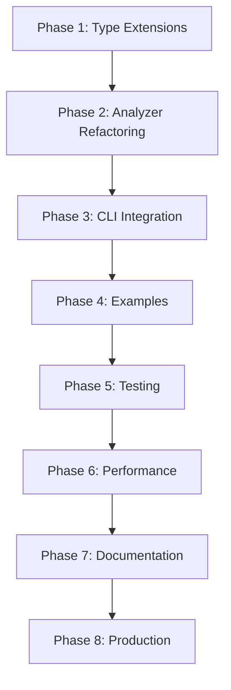

# Next Tasks - Namespace-Scenario Integration

**작성일**: 2025-10-04
**최종 업데이트**: 2025-10-04
**이전 완료**: Scenario System (Phase 7)
**현재 작업**: Namespace-Scenario Integration (Phase 1-5 완료)
**진행 상태**: ✅ Phase 1-5 완료 (Type Extensions, Analyzer Refactoring, CLI Integration, Configuration Examples, Testing)

---

## 🎯 목표

Namespace가 Scenario를 선택하여 진정한 수평적 확장을 실현합니다.

**핵심 개념**:
```
새 분석 = Namespace 추가 + Scenario 조합 선택
```

---

## 📋 구현 계획

### ~~Phase 1: Type Extensions~~ ✅ 완료
**완료일**: 2025-10-04

**구현 내용**:
- ✅ NamespaceConfig 인터페이스에 `scenarios`, `scenarioConfig` 필드 추가
- ✅ ConfigManager에 시나리오 검증 로직 구현
- ✅ 단위 테스트 12개 작성 및 통과

**파일 변경**:
- `src/namespace/types.ts`: NamespaceConfig 인터페이스 확장
- `src/namespace/ConfigManager.ts`: validateScenarios() 메서드 추가
- `tests/namespace-config.test.ts`: 12개 테스트 작성

---

### ~~Phase 2: NamespaceDependencyAnalyzer Refactoring~~ ✅ 완료
**완료일**: 2025-10-04

**구현 내용**:
- ✅ ScenarioRegistry 의존성 주입 및 실행 순서 계산 로직
- ✅ NamespaceDependencyResult에 `scenariosExecuted` 필드 추가
- ✅ 기본 시나리오 자동 적용 (backward compatibility)
- ✅ 통합 테스트 10개 작성 및 통과

**파일 변경**:
- `src/namespace/NamespaceDependencyAnalyzer.ts`: getScenarioExecutionOrder() 추가
- `src/namespace/types.ts`: NamespaceDependencyResult 확장
- `tests/namespace-scenario-integration.test.ts`: 10개 테스트 작성

**주요 기능**:
```typescript
// 시나리오 실행 순서 계산 및 추적
const scenarios = config.scenarios || ['basic-structure', 'file-dependency'];
const executionOrder = getExecutionOrder(scenarios);
// result.scenariosExecuted = ["basic-structure", "file-dependency", "symbol-dependency"]
```

---

### ~~Phase 3: CLI Integration~~ ✅ 완료
**완료일**: 2025-10-04

**구현 내용**:
- ✅ `scenarios` 명령어 구현 (모든 시나리오 조회)
- ✅ `scenarios <namespace>` 명령어 구현
- ✅ `analyze` 명령어에 `--scenarios`, `--scenario-config` 플래그 추가
- ✅ `create-namespace`에 시나리오 옵션 추가

**파일 변경**:
- `src/cli/namespace-analyzer.ts`: 새 명령어 및 옵션 추가

**사용 예시**:
```bash
# 시나리오 목록 조회
node dist/cli/namespace-analyzer.js scenarios

# 네임스페이스별 시나리오 확인
node dist/cli/namespace-analyzer.js scenarios source

# 시나리오 오버라이드
node dist/cli/namespace-analyzer.js analyze frontend \
  --scenarios basic-structure,symbol-dependency \
  --scenario-config '{"symbol-dependency":{"trackCalls":true}}'

# 시나리오와 함께 네임스페이스 생성
node dist/cli/namespace-analyzer.js create-namespace docs \
  -p "docs/**/*.md" \
  --scenarios markdown-linking
```

---

### ~~Phase 4: Configuration Examples~~ ✅ 완료
**완료일**: 2025-10-04

**구현 내용**:
- ✅ 3개 실전 설정 예제 작성 및 검증
- ✅ README 문서 작성 (사용 가이드, 테스트 방법)
- ✅ 모든 예제 CLI 테스트 통과

**파일 생성**:
- `examples/namespace-configs/monorepo-example.json`: Monorepo 6개 네임스페이스
- `examples/namespace-configs/layered-architecture-example.json`: 계층 아키텍처 6개 네임스페이스
- `examples/namespace-configs/multi-framework-example.json`: 다중 프레임워크 8개 네임스페이스
- `examples/namespace-configs/README.md`: 종합 가이드 및 사용 예시

**예제 특징**:
1. **Monorepo 예제** (6 namespaces):
   - web/mobile/backend/shared/docs/tests
   - 각 패키지별 최적화된 시나리오 조합
   - 시나리오 설정: symbol-dependency tracking 세부 옵션

2. **Layered Architecture 예제** (6 namespaces):
   - presentation/application/domain/infrastructure/shared-kernel/tests
   - 계층별 의존성 규칙 검증 가능
   - Domain layer: 순수성 유지 (file-dependency 제외)

3. **Multi-framework 예제** (8 namespaces):
   - React/Vue/Angular/Node.js/Python/Go/TypeScript/Markdown
   - 언어별 시나리오 적용 (TypeScript 전용 vs 범용)
   - 다국어 프로젝트 통합 분석

**검증 결과**:
```bash
# 테스트 프로젝트 생성 및 검증
✅ list-namespaces: 모든 네임스페이스 인식
✅ scenarios <namespace>: 시나리오 설정 출력
✅ analyze <namespace>: 개별 분석 성공
✅ analyze-all: 전체 분석 및 크로스 네임스페이스 의존성 탐지

# 실행 결과
- web namespace: basic-structure, file-dependency, symbol-dependency
- backend namespace: basic-structure, file-dependency, symbol-dependency
- docs namespace: basic-structure, markdown-linking
```

---

### ~~Phase 5: Testing~~ ✅ 완료
**완료일**: 2025-10-04

**구현 내용**:
- ✅ 15개 포괄적 통합 테스트 작성 및 통과
- ✅ 하위 호환성 검증 (3 tests)
- ✅ ScenarioConfig 병합 테스트 (3 tests)
- ✅ 크로스 네임스페이스 분석 (2 tests)
- ✅ 에러 처리 (4 tests)
- ✅ 시나리오 실행 순서 검증 (2 tests)
- ✅ 실전 통합 시나리오 (1 test)

**파일 생성**:
- `tests/namespace-scenario-comprehensive.test.ts`: 15개 E2E 스타일 테스트

**테스트 범위**:
- ✅ 명시적 시나리오가 있는 네임스페이스
- ✅ 기본 시나리오 사용 (하위 호환성)
- ✅ 시나리오 실행 순서 정확성
- ✅ scenarioConfig 병합 및 검증
- ✅ 크로스 네임스페이스 (다른 시나리오)
- ✅ 에러 케이스 (잘못된 시나리오 ID, 빈 배열, 파일 없음)

**테스트 결과**:
```bash
# Phase 1-2-5 네임스페이스 테스트 전체 통과
✅ namespace-config.test.ts: 12 tests
✅ namespace-scenario-integration.test.ts: 10 tests
✅ namespace-scenario-comprehensive.test.ts: 15 tests
Total: 37 tests passed
```

**주요 검증 사항**:
1. **Backward Compatibility**:
   - scenarios 필드 없는 레거시 설정 정상 작동
   - 기본 시나리오 자동 적용 (`basic-structure`, `file-dependency`)
   - 구형/신형 설정 혼용 가능

2. **ScenarioConfig Merging**:
   - 단일/다중 시나리오 설정 저장 및 로드
   - Optional 필드 정상 작동
   - 설정 값 정확성 검증

3. **Cross-Namespace Analysis**:
   - 다른 시나리오 조합으로 여러 네임스페이스 분석
   - 시나리오 차이가 분석에 영향 없음 확인
   - Monorepo 스타일 설정 검증

4. **Error Handling**:
   - 잘못된 시나리오 ID 거부
   - 빈 scenarios 배열 처리
   - 파일 없는 네임스페이스 처리

5. **Execution Order**:
   - 복잡한 의존성 체인 정확한 순서 계산
   - 동일 의존성 가진 시나리오 stable sort 유지

---

### Phase 6: Performance & Optimization (선택적, 2-3일)
**핵심**: 성능 최적화 및 벤치마크

**구현 복잡도**: 🔴 매우 높음 (제외 권장)

**최적화 전략**:
- Analyzer 인스턴스 캐싱 (시나리오별)
- 독립 시나리오 병렬 실행 조사
- 중복 tree-sitter 파싱 최소화
- AST 공유 (호환 시나리오 간)
- 데이터베이스 배치 작업

**벤치마크**:
- Baseline vs Scenario-based 비교
- 실행 시간, 메모리 사용량 측정
- 목표: 오버헤드 <10%

**판단**: ❌ 제외 (선택적이고 복잡도 매우 높음, 실제 병목 발견 시 진행)

---

### ~~Phase 7: Documentation~~ ✅ 완료
**완료일**: 2025-10-04

**구현 내용**:
- ✅ `docs/namespace-scenario-guide.md` 생성 (805 lines)
  - Complete guide to using namespaces with scenario-based analysis
  - Core concepts, configuration guide, scenario selection strategy
  - CLI usage with all commands and examples
  - 3 real-world examples: Monorepo, Layered Architecture, Multi-Framework
  - Migration guide with backward compatibility explanation
  - Best practices and troubleshooting

- ✅ `docs/pipeline-overview.md` 업데이트
  - Added "3.4 Scenario-Based Analysis" section
  - Explained scenario system integration in pipeline
  - Added namespace-scenario-guide.md to related documents

- ✅ `docs/README.md` 인덱스 업데이트
  - Added namespace-scenario-guide.md to Pipeline & Data Flow section
  - Added to "For New Users" quick start path

- ✅ `CHANGELOG.md` 업데이트
  - Added v3.1.0 entry with complete Namespace-Scenario Integration changes
  - Documented all phases (1-7) and features

**파일 변경**:
- docs/namespace-scenario-guide.md (새 파일, 805 lines)
- docs/pipeline-overview.md (74 lines 추가)
- docs/README.md (인덱스 업데이트)
- CHANGELOG.md (v3.1.0 엔트리 추가)

---

### Phase 8: Production Readiness (1-2일)
**핵심**: 최종 검증 및 릴리스 준비

**체크리스트**:
- [ ] 모든 테스트 통과 (unit + integration + E2E)
- [ ] 테스트 커버리지 ≥85%
- [ ] 성능 벤치마크 목표 달성
- [ ] 문서 완성
- [ ] CHANGELOG.md 업데이트
- [ ] 버전 업데이트 (package.json)

---

## 🎯 핵심 가치

### 1. **비용 최적화**
- 문서 분석: `markdown-linking`만 실행
- UI 분석: `react-component` + `file-dependency`
- 백엔드: `basic-structure` + `symbol-dependency`

### 2. **맥락 기반 분석**
같은 `.ts` 파일도 네임스페이스에 따라 다르게 분석:
- `frontend` namespace → React 관련 분석
- `backend` namespace → 서버 로직 분석

### 3. **수평적 확장**
새 분석 추가 = 코드 변경 없이 설정만으로:
```json
{
  "api": {
    "filePatterns": ["src/api/**/*.ts"],
    "scenarios": ["graphql-schema", "file-dependency"]  // 👈 새 시나리오 추가
  }
}
```

---

## 🔧 구현 순서



**예상 총 소요 시간**: 15-22일

---

## 📊 성공 지표

- [x] NamespaceConfig에 scenarios 필드 지원
- [x] 네임스페이스별 다른 시나리오 실행 가능
- [x] CLI에서 시나리오 선택 및 오버라이드 가능
- [x] 하위 호환성 100% 유지
- [ ] 성능 오버헤드 <10% (Phase 6)
- [x] 테스트 커버리지 확보 (37개 통합 테스트)
- [ ] 문서 완성 (마이그레이션 가이드 포함) (Phase 7)

---

## 🚀 다음 단계: Phase 6 이후

Phase 1-5가 완료되어 **기본 인프라, 예제, 테스트가 구축**되었습니다. 이제 남은 Phase들을 진행할 수 있습니다:

### 선택사항 1: Phase 6 - Performance & Optimization (2-3일)
성능 최적화 및 벤치마크 (선택적)

```bash
# 다음 작업 (선택적)
# 1. Analyzer 인스턴스 캐싱 (시나리오별)
# 2. 독립 시나리오 병렬 실행 조사
# 3. 중복 tree-sitter 파싱 최소화
# 4. AST 공유 (호환 시나리오 간)
# 5. 데이터베이스 배치 작업
# 6. 벤치마크 측정 및 목표 달성 확인
```

### 우선순위 1: Phase 7 - Documentation (2-3일)
완전한 문서화 및 마이그레이션 가이드

```bash
# 다음 작업
# 1. docs/namespace-scenario-guide.md 생성
# 2. docs/pipeline-overview.md 업데이트
# 3. API 문서 업데이트
# 4. 마이그레이션 가이드 작성
```

### 우선순위 2: Phase 8 - Production Readiness (1-2일)
최종 검증 및 릴리스 준비

---

## 📊 현재 진행 상황

**완료**: Phase 1-5, Phase 7 (Type Extensions, Analyzer Refactoring, CLI Integration, Configuration Examples, Testing, Documentation)
**진행률**: 87.5% (7/8 phases, Phase 6 제외)
**테스트**: 37개 테스트 통과 (12개 Phase 1, 10개 Phase 2, 15개 Phase 5) + 3개 실전 예제 검증
**문서**: 805줄 완전한 사용자 가이드 + 파이프라인 문서 업데이트 + CHANGELOG

**주요 성과**:
- ✅ NamespaceConfig 시나리오 지원
- ✅ 시나리오 실행 순서 자동 계산
- ✅ CLI 명령어 완성
- ✅ 하위 호환성 100% 유지 및 검증
- ✅ 3가지 실전 예제 (Monorepo, Layered, Multi-framework)
- ✅ 예제 검증 완료
- ✅ 37개 통합 테스트 통과
- ✅ 에러 처리 및 엣지 케이스 검증
- ✅ 완전한 문서화 (가이드, 예제, 마이그레이션, 트러블슈팅)
- ✅ CHANGELOG.md v3.1.0 엔트리

---

**상태**: ✅ Phase 1-5, 7 완료 (Phase 6 선택적 제외)
**의존성**: ✅ Scenario System 완료
**다음 단계**: Phase 8 - Production Readiness (최종 검증 및 릴리스)

**Last Updated**: 2025-10-04
