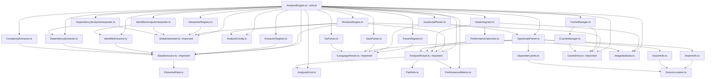

```mermaid
graph TD
    N0_src_models_ExtractedData_ts["ExtractedData.ts"]
    N1_src_extractors_IDataExtractor_ts["IDataExtractor.ts":::important]
    N2_src_extractors_ComplexityExtractor_ts["ComplexityExtractor.ts"]
    N3_src_extractors_DependencyExtractor_ts["DependencyExtractor.ts"]
    N4_src_extractors_IdentifierExtractor_ts["IdentifierExtractor.ts"]
    N5_src_interpreters_IDataInterpreter_ts["IDataInterpreter.ts":::important]
    N6_src_interpreters_DependencyAnalysisInterpreter_ts["DependencyAnalysisInterpreter.ts"]
    N7_src_interpreters_IdentifierAnalysisInterpreter_ts["IdentifierAnalysisInterpreter.ts"]
    N8_src_models_AnalysisConfig_ts["AnalysisConfig.ts"]
    N9_src_models_AnalysisError_ts["AnalysisError.ts"]
    N10_src_models_PathInfo_ts["PathInfo.ts"]
    N11_src_models_PerformanceMetrics_ts["PerformanceMetrics.ts"]
    N12_src_models_AnalysisResult_ts["AnalysisResult.ts":::important]
    N13_src_parsers_ILanguageParser_ts["ILanguageParser.ts":::important]
    N14_src_parsers_GoParser_ts["GoParser.ts"]
    N15_src_parsers_JavaParser_ts["JavaParser.ts"]
    N16_src_models_SourceLocation_ts["SourceLocation.ts"]
    N17_src_models_DependencyInfo_ts["DependencyInfo.ts"]
    N18_src_models_ExportInfo_ts["ExportInfo.ts"]
    N19_src_models_ImportInfo_ts["ImportInfo.ts"]
    N20_src_parsers_TypeScriptParser_ts["TypeScriptParser.ts"]
    N21_src_parsers_JavaScriptParser_ts["JavaScriptParser.ts"]
    N22_src_models_CacheEntry_ts["CacheEntry.ts":::important]
    N23_src_services_ICacheManager_ts["ICacheManager.ts"]
    N24_src_services_CacheManager_ts["CacheManager.ts"]
    N25_src_services_ExtractorRegistry_ts["ExtractorRegistry.ts"]
    N26_src_services_InterpreterRegistry_ts["InterpreterRegistry.ts"]
    N27_src_models_IntegratedData_ts["IntegratedData.ts"]
    N28_src_services_optimization_PerformanceOptimizer_ts["PerformanceOptimizer.ts"]
    N29_src_services_integration_DataIntegrator_ts["DataIntegrator.ts"]
    N30_src_services_ParserRegistry_ts["ParserRegistry.ts"]
    N31_src_services_IAnalysisEngine_ts["IAnalysisEngine.ts"]
    N32_src_services_AnalysisEngine_ts["AnalysisEngine.ts":::critical]
    N1_src_extractors_IDataExtractor_ts --> N0_src_models_ExtractedData_ts
    N2_src_extractors_ComplexityExtractor_ts --> N1_src_extractors_IDataExtractor_ts
    N3_src_extractors_DependencyExtractor_ts --> N1_src_extractors_IDataExtractor_ts
    N4_src_extractors_IdentifierExtractor_ts --> N1_src_extractors_IDataExtractor_ts
    N6_src_interpreters_DependencyAnalysisInterpreter_ts --> N3_src_extractors_DependencyExtractor_ts
    N6_src_interpreters_DependencyAnalysisInterpreter_ts --> N5_src_interpreters_IDataInterpreter_ts
    N7_src_interpreters_IdentifierAnalysisInterpreter_ts --> N4_src_extractors_IdentifierExtractor_ts
    N7_src_interpreters_IdentifierAnalysisInterpreter_ts --> N5_src_interpreters_IDataInterpreter_ts
    N12_src_models_AnalysisResult_ts --> N10_src_models_PathInfo_ts
    N12_src_models_AnalysisResult_ts --> N9_src_models_AnalysisError_ts
    N12_src_models_AnalysisResult_ts --> N11_src_models_PerformanceMetrics_ts
    N14_src_parsers_GoParser_ts --> N13_src_parsers_ILanguageParser_ts
    N15_src_parsers_JavaParser_ts --> N13_src_parsers_ILanguageParser_ts
    N17_src_models_DependencyInfo_ts --> N16_src_models_SourceLocation_ts
    N18_src_models_ExportInfo_ts --> N16_src_models_SourceLocation_ts
    N19_src_models_ImportInfo_ts --> N16_src_models_SourceLocation_ts
    N20_src_parsers_TypeScriptParser_ts --> N12_src_models_AnalysisResult_ts
    N20_src_parsers_TypeScriptParser_ts --> N17_src_models_DependencyInfo_ts
    N20_src_parsers_TypeScriptParser_ts --> N18_src_models_ExportInfo_ts
    N20_src_parsers_TypeScriptParser_ts --> N19_src_models_ImportInfo_ts
    N20_src_parsers_TypeScriptParser_ts --> N13_src_parsers_ILanguageParser_ts
    N21_src_parsers_JavaScriptParser_ts --> N20_src_parsers_TypeScriptParser_ts
    N21_src_parsers_JavaScriptParser_ts --> N13_src_parsers_ILanguageParser_ts
    N23_src_services_ICacheManager_ts --> N22_src_models_CacheEntry_ts
    N24_src_services_CacheManager_ts --> N23_src_services_ICacheManager_ts
    N24_src_services_CacheManager_ts --> N22_src_models_CacheEntry_ts
    N25_src_services_ExtractorRegistry_ts --> N1_src_extractors_IDataExtractor_ts
    N26_src_services_InterpreterRegistry_ts --> N5_src_interpreters_IDataInterpreter_ts
    N28_src_services_optimization_PerformanceOptimizer_ts --> N12_src_models_AnalysisResult_ts
    N28_src_services_optimization_PerformanceOptimizer_ts --> N27_src_models_IntegratedData_ts
    N29_src_services_integration_DataIntegrator_ts --> N12_src_models_AnalysisResult_ts
    N29_src_services_integration_DataIntegrator_ts --> N27_src_models_IntegratedData_ts
    N29_src_services_integration_DataIntegrator_ts --> N28_src_services_optimization_PerformanceOptimizer_ts
    N30_src_services_ParserRegistry_ts --> N13_src_parsers_ILanguageParser_ts
    N31_src_services_IAnalysisEngine_ts --> N1_src_extractors_IDataExtractor_ts
    N31_src_services_IAnalysisEngine_ts --> N5_src_interpreters_IDataInterpreter_ts
    N31_src_services_IAnalysisEngine_ts --> N8_src_models_AnalysisConfig_ts
    N31_src_services_IAnalysisEngine_ts --> N12_src_models_AnalysisResult_ts
    N31_src_services_IAnalysisEngine_ts --> N22_src_models_CacheEntry_ts
    N32_src_services_AnalysisEngine_ts --> N2_src_extractors_ComplexityExtractor_ts
    N32_src_services_AnalysisEngine_ts --> N3_src_extractors_DependencyExtractor_ts
    N32_src_services_AnalysisEngine_ts --> N4_src_extractors_IdentifierExtractor_ts
    N32_src_services_AnalysisEngine_ts --> N6_src_interpreters_DependencyAnalysisInterpreter_ts
    N32_src_services_AnalysisEngine_ts --> N7_src_interpreters_IdentifierAnalysisInterpreter_ts
    N32_src_services_AnalysisEngine_ts --> N8_src_models_AnalysisConfig_ts
    N32_src_services_AnalysisEngine_ts --> N9_src_models_AnalysisError_ts
    N32_src_services_AnalysisEngine_ts --> N12_src_models_AnalysisResult_ts
    N32_src_services_AnalysisEngine_ts --> N11_src_models_PerformanceMetrics_ts
    N32_src_services_AnalysisEngine_ts --> N14_src_parsers_GoParser_ts
    N32_src_services_AnalysisEngine_ts --> N15_src_parsers_JavaParser_ts
    N32_src_services_AnalysisEngine_ts --> N21_src_parsers_JavaScriptParser_ts
    N32_src_services_AnalysisEngine_ts --> N20_src_parsers_TypeScriptParser_ts
    N32_src_services_AnalysisEngine_ts --> N24_src_services_CacheManager_ts
    N32_src_services_AnalysisEngine_ts --> N25_src_services_ExtractorRegistry_ts
    N32_src_services_AnalysisEngine_ts --> N26_src_services_InterpreterRegistry_ts
    N32_src_services_AnalysisEngine_ts --> N29_src_services_integration_DataIntegrator_ts
    N32_src_services_AnalysisEngine_ts --> N30_src_services_ParserRegistry_ts
    N32_src_services_AnalysisEngine_ts --> N1_src_extractors_IDataExtractor_ts
    N32_src_services_AnalysisEngine_ts --> N5_src_interpreters_IDataInterpreter_ts
    N32_src_services_AnalysisEngine_ts --> N22_src_models_CacheEntry_ts
    N32_src_services_AnalysisEngine_ts --> N27_src_models_IntegratedData_ts
    N32_src_services_AnalysisEngine_ts --> N31_src_services_IAnalysisEngine_ts

    classDef critical fill:#ff6b6b,stroke:#333,stroke-width:2px
    classDef important fill:#4ecdc4,stroke:#333,stroke-width:2px
```