📊 의존성 분석 종합 리포트
============================================================
📁 분석 대상: src/services/AnalysisEngine.ts
🕒 분석 시간: 2025. 9. 23. 오전 3:24:54
📈 총 파일 수: 33개
📊 최대 깊이: 4
🔄 순환 의존성: 0개

🌳 의존성 트리: src/services/AnalysisEngine.ts

└── 📄 src/services/AnalysisEngine.ts [d:0, deps:23]
    ├── 📄 src/extractors/ComplexityExtractor.ts [d:1, deps:1]
    │   └── 📄 src/extractors/IDataExtractor.ts [d:2, deps:1]
    │       └── 📄 src/models/ExtractedData.ts [d:3, deps:0]
    ├── 📄 src/extractors/DependencyExtractor.ts [d:1, deps:1]
    ├── 📄 src/extractors/IdentifierExtractor.ts [d:1, deps:1]
    ├── 📄 src/interpreters/DependencyAnalysisInterpreter.ts [d:1, deps:2]
    │   └── 📄 src/interpreters/IDataInterpreter.ts [d:2, deps:0]
    ├── 📄 src/interpreters/IdentifierAnalysisInterpreter.ts [d:1, deps:2]
    ├── 📄 src/models/AnalysisConfig.ts [d:1, deps:0]
    ├── 📄 src/models/AnalysisError.ts [d:1, deps:0]
    ├── 📄 src/models/AnalysisResult.ts [d:1, deps:3]
    │   ├── 📄 src/models/PathInfo.ts [d:2, deps:0]
    │   └── 📄 src/models/PerformanceMetrics.ts [d:2, deps:0]
    ├── 📄 src/parsers/GoParser.ts [d:1, deps:1]
    │   └── 📄 src/parsers/ILanguageParser.ts [d:2, deps:0]
    ├── 📄 src/parsers/JavaParser.ts [d:1, deps:1]
    ├── 📄 src/parsers/JavaScriptParser.ts [d:1, deps:2]
    │   ├── 📄 src/parsers/TypeScriptParser.ts [d:2, deps:5]
    │   │   ├── 📄 src/models/DependencyInfo.ts [d:3, deps:1]
    │   │   │   └── 📄 src/models/SourceLocation.ts [d:4, deps:0]
    │   │   ├── 📄 src/models/ExportInfo.ts [d:3, deps:1]
    │   │   ├── 📄 src/models/ImportInfo.ts [d:3, deps:1]
    ├── 📄 src/services/CacheManager.ts [d:1, deps:2]
    │   ├── 📄 src/services/ICacheManager.ts [d:2, deps:1]
    │   │   └── 📄 src/models/CacheEntry.ts [d:3, deps:0]
    ├── 📄 src/services/ExtractorRegistry.ts [d:1, deps:1]
    ├── 📄 src/services/InterpreterRegistry.ts [d:1, deps:1]
    ├── 📄 src/services/integration/DataIntegrator.ts [d:1, deps:3]
    │   ├── 📄 src/models/IntegratedData.ts [d:2, deps:0]
    │   └── 📄 src/services/optimization/PerformanceOptimizer.ts [d:2, deps:2]
    ├── 📄 src/services/ParserRegistry.ts [d:1, deps:1]
    └── 📄 src/services/IAnalysisEngine.ts [d:1, deps:5]

📂 디렉토리별 의존성 요약
==================================================

📁 src/models
  📊 파일 수: 12개
  📤 총 의존성: 6개
  📥 총 피의존성: 26개
  📈 최대 깊이: 4
  📄 주요 파일들: ExtractedData.ts, AnalysisConfig.ts, AnalysisError.ts 외 9개

📁 src/services
  📊 파일 수: 7개
  📤 총 의존성: 34개
  📥 총 피의존성: 6개
  📈 최대 깊이: 2
  📄 주요 파일들: ICacheManager.ts, CacheManager.ts, ExtractorRegistry.ts 외 4개

📁 src/parsers
  📊 파일 수: 5개
  📤 총 의존성: 9개
  📥 총 피의존성: 10개
  📈 최대 깊이: 2
  📄 파일들: ILanguageParser.ts, GoParser.ts, JavaParser.ts, TypeScriptParser.ts, JavaScriptParser.ts

📁 src/extractors
  📊 파일 수: 4개
  📤 총 의존성: 4개
  📥 총 피의존성: 11개
  📈 최대 깊이: 2
  📄 파일들: IDataExtractor.ts, ComplexityExtractor.ts, DependencyExtractor.ts, IdentifierExtractor.ts

📁 src/interpreters
  📊 파일 수: 3개
  📤 총 의존성: 4개
  📥 총 피의존성: 7개
  📈 최대 깊이: 2
  📄 파일들: IDataInterpreter.ts, DependencyAnalysisInterpreter.ts, IdentifierAnalysisInterpreter.ts

📁 src/services/optimization
  📊 파일 수: 1개
  📤 총 의존성: 2개
  📥 총 피의존성: 1개
  📈 최대 깊이: 2
  📄 파일들: PerformanceOptimizer.ts

📁 src/services/integration
  📊 파일 수: 1개
  📤 총 의존성: 3개
  📥 총 피의존성: 1개
  📈 최대 깊이: 1
  📄 파일들: DataIntegrator.ts

🎯 핵심 의존성 분석
========================================

🔄 높은 의존성 파일 (허브 노드):
  1. src/services/AnalysisEngine.ts (23개 의존성)
  2. src/parsers/TypeScriptParser.ts (5개 의존성)
  3. src/services/IAnalysisEngine.ts (5개 의존성)
  4. src/models/AnalysisResult.ts (3개 의존성)
  5. src/services/integration/DataIntegrator.ts (3개 의존성)

⭐ 많이 의존받는 파일 (인기 노드):
  1. src/extractors/IDataExtractor.ts (6개가 의존)
  2. src/interpreters/IDataInterpreter.ts (5개가 의존)
  3. src/models/AnalysisResult.ts (5개가 의존)
  4. src/parsers/ILanguageParser.ts (5개가 의존)
  5. src/models/CacheEntry.ts (4개가 의존)

⚠️  잠재적 병목 지점:
  1. src/models/AnalysisResult.ts (의존성: 3, 피의존성: 5, 총점: 8)
  2. src/parsers/TypeScriptParser.ts (의존성: 5, 피의존성: 2, 총점: 7)

🎨 Mermaid 그래프 코드:
------------------------------

```mermaid
graph TD
    N0_src_models_ExtractedData_ts["ExtractedData.ts"]
    N1_src_extractors_IDataExtractor_ts["IDataExtractor.ts":::important]
    N2_src_extractors_ComplexityExtractor_ts["ComplexityExtractor.ts"]
    N3_src_extractors_DependencyExtractor_ts["DependencyExtractor.ts"]
    N4_src_extractors_IdentifierExtractor_ts["IdentifierExtractor.ts"]
    N5_src_interpreters_IDataInterpreter_ts["IDataInterpreter.ts":::important]
    N6_src_interpreters_DependencyAnalysisInterpreter_ts["DependencyAnalysisInterpreter.ts"]
    N7_src_interpreters_IdentifierAnalysisInterpreter_ts["IdentifierAnalysisInterpreter.ts"]
    N8_src_models_AnalysisConfig_ts["AnalysisConfig.ts"]
    N9_src_models_AnalysisError_ts["AnalysisError.ts"]
    N10_src_models_PathInfo_ts["PathInfo.ts"]
    N11_src_models_PerformanceMetrics_ts["PerformanceMetrics.ts"]
    N12_src_models_AnalysisResult_ts["AnalysisResult.ts":::important]
    N13_src_parsers_ILanguageParser_ts["ILanguageParser.ts":::important]
    N14_src_parsers_GoParser_ts["GoParser.ts"]
    N15_src_parsers_JavaParser_ts["JavaParser.ts"]
    N16_src_models_SourceLocation_ts["SourceLocation.ts"]
    N17_src_models_DependencyInfo_ts["DependencyInfo.ts"]
    N18_src_models_ExportInfo_ts["ExportInfo.ts"]
    N19_src_models_ImportInfo_ts["ImportInfo.ts"]
    N20_src_parsers_TypeScriptParser_ts["TypeScriptParser.ts"]
    N21_src_parsers_JavaScriptParser_ts["JavaScriptParser.ts"]
    N22_src_models_CacheEntry_ts["CacheEntry.ts":::important]
    N23_src_services_ICacheManager_ts["ICacheManager.ts"]
    N24_src_services_CacheManager_ts["CacheManager.ts"]
    N25_src_services_ExtractorRegistry_ts["ExtractorRegistry.ts"]
    N26_src_services_InterpreterRegistry_ts["InterpreterRegistry.ts"]
    N27_src_models_IntegratedData_ts["IntegratedData.ts"]
    N28_src_services_optimization_PerformanceOptimizer_ts["PerformanceOptimizer.ts"]
    N29_src_services_integration_DataIntegrator_ts["DataIntegrator.ts"]
    N30_src_services_ParserRegistry_ts["ParserRegistry.ts"]
    N31_src_services_IAnalysisEngine_ts["IAnalysisEngine.ts"]
    N32_src_services_AnalysisEngine_ts["AnalysisEngine.ts":::critical]
    N1_src_extractors_IDataExtractor_ts --> N0_src_models_ExtractedData_ts
    N2_src_extractors_ComplexityExtractor_ts --> N1_src_extractors_IDataExtractor_ts
    N3_src_extractors_DependencyExtractor_ts --> N1_src_extractors_IDataExtractor_ts
    N4_src_extractors_IdentifierExtractor_ts --> N1_src_extractors_IDataExtractor_ts
    N6_src_interpreters_DependencyAnalysisInterpreter_ts --> N3_src_extractors_DependencyExtractor_ts
    N6_src_interpreters_DependencyAnalysisInterpreter_ts --> N5_src_interpreters_IDataInterpreter_ts
    N7_src_interpreters_IdentifierAnalysisInterpreter_ts --> N4_src_extractors_IdentifierExtractor_ts
    N7_src_interpreters_IdentifierAnalysisInterpreter_ts --> N5_src_interpreters_IDataInterpreter_ts
    N12_src_models_AnalysisResult_ts --> N10_src_models_PathInfo_ts
    N12_src_models_AnalysisResult_ts --> N9_src_models_AnalysisError_ts
    N12_src_models_AnalysisResult_ts --> N11_src_models_PerformanceMetrics_ts
    N14_src_parsers_GoParser_ts --> N13_src_parsers_ILanguageParser_ts
    N15_src_parsers_JavaParser_ts --> N13_src_parsers_ILanguageParser_ts
    N17_src_models_DependencyInfo_ts --> N16_src_models_SourceLocation_ts
    N18_src_models_ExportInfo_ts --> N16_src_models_SourceLocation_ts
    N19_src_models_ImportInfo_ts --> N16_src_models_SourceLocation_ts
    N20_src_parsers_TypeScriptParser_ts --> N12_src_models_AnalysisResult_ts
    N20_src_parsers_TypeScriptParser_ts --> N17_src_models_DependencyInfo_ts
    N20_src_parsers_TypeScriptParser_ts --> N18_src_models_ExportInfo_ts
    N20_src_parsers_TypeScriptParser_ts --> N19_src_models_ImportInfo_ts
    N20_src_parsers_TypeScriptParser_ts --> N13_src_parsers_ILanguageParser_ts
    N21_src_parsers_JavaScriptParser_ts --> N20_src_parsers_TypeScriptParser_ts
    N21_src_parsers_JavaScriptParser_ts --> N13_src_parsers_ILanguageParser_ts
    N23_src_services_ICacheManager_ts --> N22_src_models_CacheEntry_ts
    N24_src_services_CacheManager_ts --> N23_src_services_ICacheManager_ts
    N24_src_services_CacheManager_ts --> N22_src_models_CacheEntry_ts
    N25_src_services_ExtractorRegistry_ts --> N1_src_extractors_IDataExtractor_ts
    N26_src_services_InterpreterRegistry_ts --> N5_src_interpreters_IDataInterpreter_ts
    N28_src_services_optimization_PerformanceOptimizer_ts --> N12_src_models_AnalysisResult_ts
    N28_src_services_optimization_PerformanceOptimizer_ts --> N27_src_models_IntegratedData_ts
    N29_src_services_integration_DataIntegrator_ts --> N12_src_models_AnalysisResult_ts
    N29_src_services_integration_DataIntegrator_ts --> N27_src_models_IntegratedData_ts
    N29_src_services_integration_DataIntegrator_ts --> N28_src_services_optimization_PerformanceOptimizer_ts
    N30_src_services_ParserRegistry_ts --> N13_src_parsers_ILanguageParser_ts
    N31_src_services_IAnalysisEngine_ts --> N1_src_extractors_IDataExtractor_ts
    N31_src_services_IAnalysisEngine_ts --> N5_src_interpreters_IDataInterpreter_ts
    N31_src_services_IAnalysisEngine_ts --> N8_src_models_AnalysisConfig_ts
    N31_src_services_IAnalysisEngine_ts --> N12_src_models_AnalysisResult_ts
    N31_src_services_IAnalysisEngine_ts --> N22_src_models_CacheEntry_ts
    N32_src_services_AnalysisEngine_ts --> N2_src_extractors_ComplexityExtractor_ts
    N32_src_services_AnalysisEngine_ts --> N3_src_extractors_DependencyExtractor_ts
    N32_src_services_AnalysisEngine_ts --> N4_src_extractors_IdentifierExtractor_ts
    N32_src_services_AnalysisEngine_ts --> N6_src_interpreters_DependencyAnalysisInterpreter_ts
    N32_src_services_AnalysisEngine_ts --> N7_src_interpreters_IdentifierAnalysisInterpreter_ts
    N32_src_services_AnalysisEngine_ts --> N8_src_models_AnalysisConfig_ts
    N32_src_services_AnalysisEngine_ts --> N9_src_models_AnalysisError_ts
    N32_src_services_AnalysisEngine_ts --> N12_src_models_AnalysisResult_ts
    N32_src_services_AnalysisEngine_ts --> N11_src_models_PerformanceMetrics_ts
    N32_src_services_AnalysisEngine_ts --> N14_src_parsers_GoParser_ts
    N32_src_services_AnalysisEngine_ts --> N15_src_parsers_JavaParser_ts
    N32_src_services_AnalysisEngine_ts --> N21_src_parsers_JavaScriptParser_ts
    N32_src_services_AnalysisEngine_ts --> N20_src_parsers_TypeScriptParser_ts
    N32_src_services_AnalysisEngine_ts --> N24_src_services_CacheManager_ts
    N32_src_services_AnalysisEngine_ts --> N25_src_services_ExtractorRegistry_ts
    N32_src_services_AnalysisEngine_ts --> N26_src_services_InterpreterRegistry_ts
    N32_src_services_AnalysisEngine_ts --> N29_src_services_integration_DataIntegrator_ts
    N32_src_services_AnalysisEngine_ts --> N30_src_services_ParserRegistry_ts
    N32_src_services_AnalysisEngine_ts --> N1_src_extractors_IDataExtractor_ts
    N32_src_services_AnalysisEngine_ts --> N5_src_interpreters_IDataInterpreter_ts
    N32_src_services_AnalysisEngine_ts --> N22_src_models_CacheEntry_ts
    N32_src_services_AnalysisEngine_ts --> N27_src_models_IntegratedData_ts
    N32_src_services_AnalysisEngine_ts --> N31_src_services_IAnalysisEngine_ts

    classDef critical fill:#ff6b6b,stroke:#333,stroke-width:2px
    classDef important fill:#4ecdc4,stroke:#333,stroke-width:2px
```
